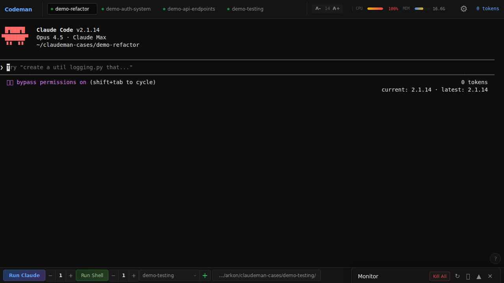
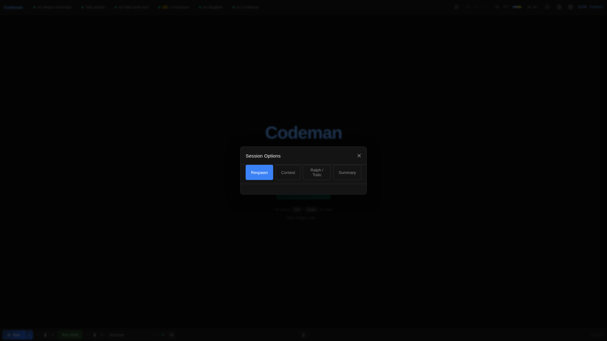
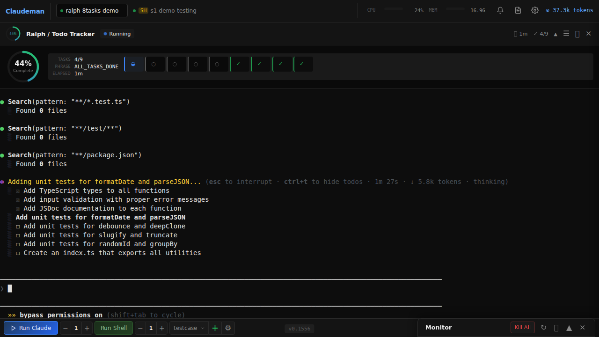
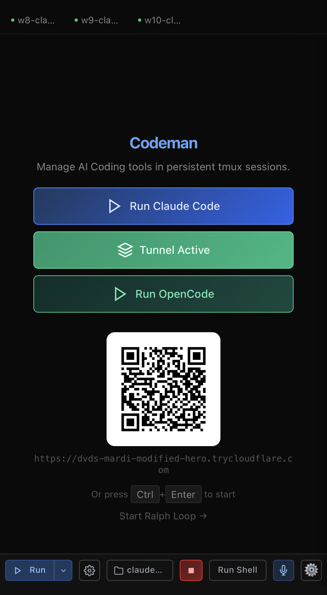
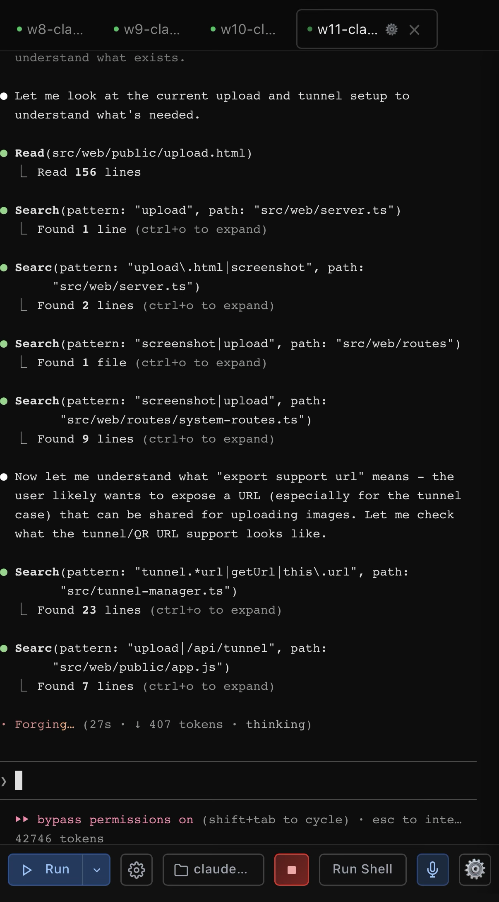
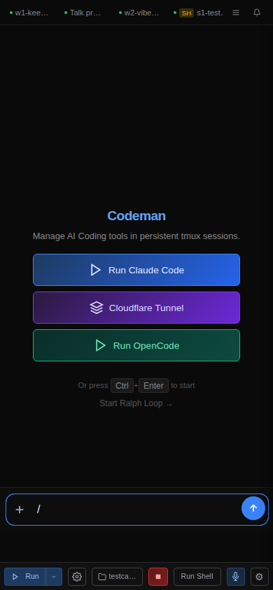
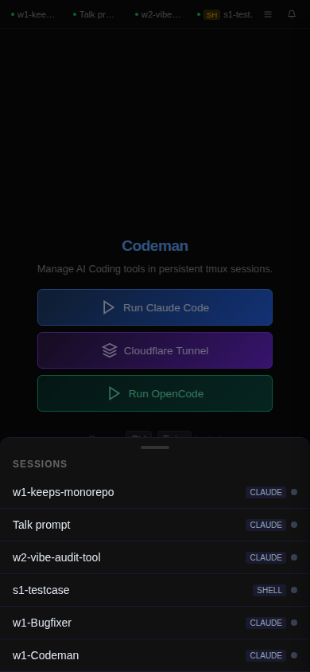
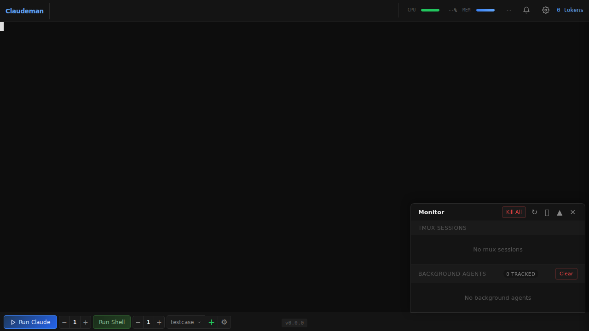
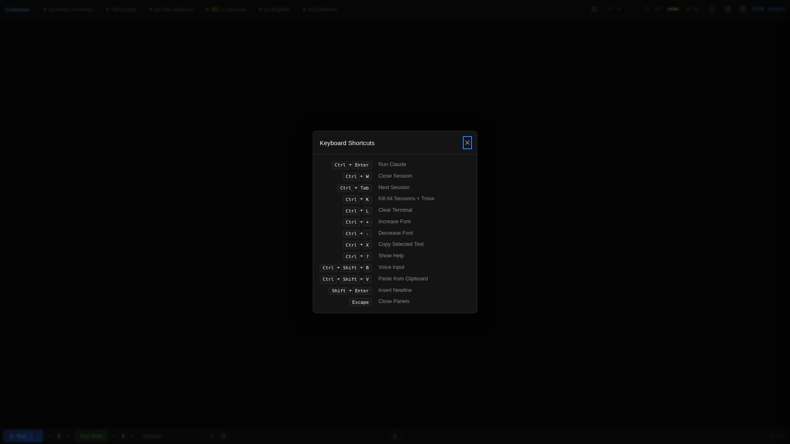

# Codeman — Feature Reference

This document is the comprehensive feature reference for **Codeman v0.5.4** (SGudbrandsson fork). It covers every major feature with configuration details, technical specifics, and relevant API endpoints. For installation and quick-start, see [README.md](./README.md). For architecture and development guidance, see [CLAUDE.md](./CLAUDE.md).

---

## Table of Contents

1. [Multi-Session Dashboard](#1-multi-session-dashboard)
2. [Respawn Controller](#2-respawn-controller)
3. [Ralph Loop / Todo Tracking](#3-ralph-loop--todo-tracking)
4. [Zero-Lag Input Overlay](#4-zero-lag-input-overlay)
5. [Mobile-Optimized UI](#5-mobile-optimized-ui)
6. [Voice Input](#6-voice-input)
7. [Live Agent Visualization](#7-live-agent-visualization)
8. [Multi-Layer Notifications](#8-multi-layer-notifications)
9. [Remote Access & QR Authentication](#9-remote-access--qr-authentication)
10. [Agent Teams (Experimental)](#10-agent-teams-experimental)
11. [Token Management & Auto-Compact](#11-token-management--auto-compact)
12. [Slash Commands & Plugin System](#12-slash-commands--plugin-system)
13. [Keyboard Shortcuts](#13-keyboard-shortcuts)
14. [Case Management](#14-case-management)
15. [Run Summary & Analytics](#15-run-summary--analytics)
16. [SSH Session Chooser (`sc`)](#16-ssh-session-chooser-sc)
17. [Plan Mode Auto-Accept](#17-plan-mode-auto-accept)
18. [Terminal Anti-Flicker Pipeline](#18-terminal-anti-flicker-pipeline)
19. [Security](#19-security)
20. [API Reference](#20-api-reference)
21. [Fork Differences vs Ark0N/Codeman v0.3.7](#fork-differences-vs-ark0ncodeman-v037)

---

## 1. Multi-Session Dashboard

Codeman's primary view manages up to 50 concurrent Claude Code (or OpenCode) sessions from a single browser tab. Each session is a full xterm.js terminal backed by a persistent tmux pane, rendering at 60fps via SSE streaming.



- **Up to 50 concurrent sessions** — configurable limit in `src/config/map-limits.ts` (`MAX_CONCURRENT_SESSIONS`)
- **Real-time xterm.js terminals** — full ANSI/VT100 support, 500-line scrollback (configurable per session)
- **Tab-based navigation** — each session gets a tab with live status indicators: token count, cost, agent count badge, and blink alerts for attention-required states
- **Per-session token and cost tracking** — reads Claude Code's JSON message stream; tracks input tokens, output tokens, cache tokens, and cumulative USD cost
- **tmux-backed persistence** — sessions survive server restarts, network drops, and machine sleep; auto-recovered on startup
- **Ghost session discovery** — finds orphaned tmux sessions from previous runs and reattaches them
- **Managed session tagging** — `CODEMAN_MUX=1` environment variable prevents the agent from killing its own tmux session
- **Quick-start** — `Ctrl+Enter` or the Start button creates a session from the last-used case

---

## 2. Respawn Controller

The respawn controller is the engine for unattended autonomous work. When a session goes idle, it runs a configurable command sequence to summarize progress, reset context, re-initialize, and continue — enabling 24+ hour continuous runs.



### State Machine

```
WATCHING → CONFIRMING_IDLE → AI_CHECKING → SENDING_UPDATE → WAITING_UPDATE
    → SENDING_CLEAR → WAITING_CLEAR → SENDING_INIT → WAITING_INIT
    → MONITORING_INIT → SENDING_KICKSTART → WAITING_KICKSTART → (back to WATCHING)
```

### Idle Detection (Multi-Layer)

The controller uses six independent signals to confirm genuine idle state before triggering the respawn sequence:

1. **Completion message** — detects the "Worked for Xm Xs" time pattern (requires "Worked" prefix to avoid false positives)
2. **AI idle check** — spawns a fresh `claude-opus-4-5-20251101` session in tmux to analyze the last 16,000 characters of terminal output and return an IDLE/WORKING verdict; conservative by design (defaults to WORKING when uncertain); 90s timeout, 3-minute cooldown after WORKING, auto-disables after 3 consecutive errors
3. **Output silence** — waits for `completionConfirmMs` (10s) of no new output
4. **Token stability** — token count unchanged
5. **Working patterns absent** — no `Thinking`, `Writing`, `Running`, spinner chars, or 20+ other Ink activity patterns for at least 8 seconds, checked in a rolling 300-character window
6. **Session.isWorking check** — final gate: if the Session class reports `isWorking=true`, idle confirmation is rejected

### Command Sequence (Configurable)

After idle is confirmed, the controller runs (in order, each step waits for 10s of output silence before proceeding):

| Step | Config flag | Default |
|------|-------------|---------|
| Send update prompt | always | Summarize progress |
| Send `/clear` | `sendClear: true` | Resets context |
| Send `/init` | `sendInit: true` | Reinitializes with CLAUDE.md |
| Send kickstart prompt | `kickstartPrompt` | Continue from context |

### Built-in Presets

| Preset ID | Name | Idle Timeout | Max Duration | Use Case |
|-----------|------|-------------|-------------|---------|
| `solo-work` | Solo | 3s | 60 min | Single Claude working alone |
| `subagent-workflow` | Subagents | 45s | 240 min | Lead session with Task tool |
| `team-lead` | Team | 90s | 480 min | Agent team coordination |
| `ralph-todo` | Ralph/Todo | 8s | 480 min | Ralph Loop with task list |
| `overnight-autonomous` | Overnight | 10s | 480 min | Unattended overnight runs |

### Circuit Breaker

Prevents respawn thrashing when Claude is genuinely stuck:

- **CLOSED** → normal operation
- **HALF_OPEN** → monitoring after issues
- **OPEN** → respawn suspended; manual reset via `POST /api/sessions/:id/ralph-circuit-breaker/reset`

Tracks consecutive no-progress cycles and repeated errors to determine circuit state.

### Health Scoring

0–100 composite score with component scores for: cycle success rate, circuit breaker state, iteration progress toward goal, and stuck-recovery history. Visible in the session tab and run summary.

### Configuration API

```
POST /api/sessions/:id/respawn/enable    # Enable with config + timer
POST /api/sessions/:id/respawn/stop      # Stop controller
PUT  /api/sessions/:id/respawn/config    # Update config live
```

Deeper reference: [`docs/respawn-state-machine.md`](docs/respawn-state-machine.md)

---

## 3. Ralph Loop / Todo Tracking

Codeman implements first-class tracking for the Ralph Wiggum autonomous loop technique — detecting promise tags, todo progress, and iteration counts from terminal output, and surfacing them as a real-time progress panel.



### What is Ralph Loop?

Ralph Wiggum is an autonomous iteration technique: Claude processes a prompt, a Stop hook intercepts exit, checks for a completion promise tag, and restarts the prompt if not found. Previous work persists in files, enabling autonomous improvement. Created by Geoffrey Huntley, formalized as an official Anthropic plugin.

### Auto-Detection Patterns

The `RalphTracker` class (`src/ralph-tracker.ts`) automatically enables when it detects any of:

| Signal | Example |
|--------|---------|
| Ralph command | `/ralph-loop:ralph-loop` |
| Promise tag | `<promise>COMPLETE</promise>` |
| TodoWrite output | `Todos have been modified` |
| Iteration counter | `Iteration 5/50` or `[5/50]` |
| Todo checkbox | `- [ ] Task name` |
| Todo indicator | `Todo: ☐ Task name` |

### Todo Formats Detected

- Markdown checkboxes: `- [ ]`, `- [x]`, `- [X]`
- Status indicators: `Todo: ☐`, `Todo: ◐`, `Todo: ✓`
- Parenthetical status: `(pending)`, `(in_progress)`, `(completed)`
- Native checkboxes: `☐`, `◐`, `☒`
- Claude Code TodoWrite output: `✔ Task #1 created: ...`, `✔ Task #1 updated: status → completed`

### False Positive Prevention

Occurrence-based detection distinguishes the completion phrase in the prompt from actual completion output:
- 1st occurrence → stores as expected phrase (likely in the prompt itself)
- 2nd occurrence → emits `completionDetected` (actual completion)
- If loop is already active → first occurrence triggers immediately

### Plugin Commands

```bash
/ralph-loop:ralph-loop    # Start Ralph Loop in current session
/ralph-loop:cancel-ralph  # Cancel active loop
/ralph-loop:help          # Show usage
```

### API

```
GET  /api/sessions/:id/ralph-state    # Loop state + todo list + stats
POST /api/sessions/:id/ralph-config   # Configure: enable, reset, completionPhrase
```

### SSE Events

| Event | When |
|-------|------|
| `session:ralphLoopUpdate` | Loop state changes |
| `session:ralphTodoUpdate` | Todos detected or updated |
| `session:ralphCompletionDetected` | Completion phrase found |

Deeper reference: [`docs/ralph-wiggum-guide.md`](docs/ralph-wiggum-guide.md)

---

## 4. Zero-Lag Input Overlay

Over high-latency connections (VPN, Tailscale, SSH tunnel), keystroke round-trips add 200–300ms of perceived lag. The zero-lag input overlay eliminates this by rendering typed characters instantly as a pixel-perfect DOM overlay inside xterm.js.

- **Mosh-inspired local echo** — characters appear at 0ms; PTY forwarding happens in 50ms debounced batches in the background
- **Ink-proof architecture** — implemented as a `<span>` at `z-index: 7` inside `.xterm-screen`; completely immune to Ink's constant full-screen redraws (two previous approaches using `terminal.write()` failed because Ink corrupts injected buffer content)
- **Font-matched rendering** — reads `fontFamily`, `fontSize`, `fontWeight`, and `letterSpacing` from xterm.js computed styles; overlay text is visually indistinguishable from real terminal output
- **Full editing support** — backspace, retype, paste (multi-char), cursor tracking, multi-line wrap when input exceeds terminal width
- **Seamless hand-off** — when the server echo arrives 200–300ms later, the overlay disappears and real terminal text takes over; transition is invisible
- **Persistent across reconnects** — unsent input survives page reloads via localStorage
- **Enabled by default** — works on desktop and mobile, during idle and busy sessions

The overlay is extracted as a standalone npm package:

```bash
npm install xterm-zerolag-input
```

See the [xterm-zerolag-input package](packages/xterm-zerolag-input/README.md) for standalone usage.

---

## 5. Mobile-Optimized UI

Codeman's mobile interface is purpose-built for real remote work from a phone — not a desktop UI squeezed onto a small screen.





### Keyboard Accessory Bar

A persistent bar above the virtual keyboard provides quick-action buttons:
- Default buttons: `tab`, `scroll-up`, `scroll-down`, `commands`, `paste`, `copy`
- Configurable via `hotbarButtons` in localStorage settings
- Destructive commands require double-press confirmation (first tap arms, second tap executes) — prevents accidental firing on a bumpy commute
- `barHeight` = 124px when accessory bar visible, 40px when hidden

### Compose Panel

Tap the pencil icon to open a full-width auto-growing textarea above the keyboard (`z-index: 52`, `position: fixed`):


- **Auto-grow textarea** — expands as you type, collapses when cleared
- **Image attachments** — tap the `+` button (bottom-left inset) for an action sheet: Take Photo, Photo Library, or Attach File; multiple images attach as thumbnails with tap-to-preview, long-press-to-replace, and `×` to remove
- **Send button** — dispatches all queued images then the text; clears the panel and sends a trailing `\r`
- **Slash command popup** — type `/` to see built-in Claude commands merged with session-specific plugin commands; supports substring and subsequence matching (see [Section 12](#12-slash-commands--plugin-system))



### Session Navigation Drawer

Slide-out session navigation drawer (this fork only):



- **Swipe navigation** — swipe left/right on the terminal to switch sessions (80px threshold, 300ms)
- **Session drawer** — slide-out panel showing all sessions with status indicators

### Smart Keyboard Handling

- Uses `visualViewport` API with 100px threshold to detect iOS address bar drift
- Toolbar and terminal shift up when the keyboard opens via three layout paths: `updateLayout`, `resetLayout`, and resize-mode detection for Android
- Keyboard state is preserved on tab switch (this fork fixes a double-accounting bug in the upstream)
- Safe area support: respects iPhone notch and home indicator via `env(safe-area-inset-*)`

### Other Mobile Features

- **44px touch targets** — all buttons meet iOS Human Interface Guidelines minimum sizes
- **Bottom sheet case picker** — slide-up modal replaces the desktop dropdown
- **Native momentum scrolling** — `-webkit-overflow-scrolling: touch`
- **GSD Status Strip** — pinned persistent strip above the accessory bar showing current task status (this fork only)
- **Optional persistent compose panel** — toggle to always show the input panel rather than auto-hide it

Access over HTTPS (required for non-localhost):

```bash
codeman web --https
# Or use Tailscale for private network access without TLS certificates
```

---

## 6. Voice Input

Dictate commands and prompts using the browser's Web Speech API — useful for hands-free operation or when typing on mobile is inconvenient.

- **Web Speech API** — uses the browser's native speech recognition (no external API key required)
- **Microphone button** — appears in the input area; tap to start, tap again to stop
- **Auto-send option** — configurable to automatically send the transcribed text when speech ends
- **Language support** — inherits the browser's configured speech recognition language
- **Mobile optimized** — integrated into the mobile compose panel and accessory bar

Enable: tap the microphone icon in the compose panel or accessory bar. Requires browser microphone permission.

---

## 7. Live Agent Visualization

Watch background subagents work in real-time. Codeman monitors Claude Code's subagent transcript files and renders each agent as a draggable floating window with animated connection lines back to the parent session.



- **Floating terminal windows** — draggable, resizable panels for each agent showing a live activity log of every tool call, file read, and progress update
- **Connection lines** — animated green SVG lines linking parent sessions to child agents; update in real-time as agents spawn and complete
- **Status & model badges** — green (active), yellow (idle), blue (completed) color coding; Haiku/Sonnet/Opus model color coding
- **Auto-behavior** — windows auto-open on spawn, auto-minimize on completion; tab badge shows "AGENT" or "AGENTS (n)"
- **Nested agent hierarchies** — supports 3-level nesting: lead session → teammate agents → sub-subagents
- **Z-index layers** — subagent windows at 1000, plan agents at 1100, log viewers at 2000, image popups at 3000

### How Discovery Works

`SubagentWatcher` polls `~/.claude/projects/*/subagents/agent-*.jsonl` files, parsing the JSONL transcript to extract tool calls, tool results, and status. Updates are broadcast via SSE to all connected clients.

### API

```
GET    /api/subagents              # List all background agents
GET    /api/subagents/:id          # Agent info and current status
GET    /api/subagents/:id/transcript  # Full JSONL activity transcript
DELETE /api/subagents/:id          # Kill agent process
```

---

## 8. Multi-Layer Notifications

Codeman delivers alerts through multiple channels so you never miss a session that needs attention.

- **Tab blink alerts** — red blink for `permission_prompt` and `elicitation_dialog` (requires immediate action); yellow blink for `idle_prompt`; click any blinking tab to jump directly to it
- **Browser push notifications** — Web Push API; subscribe via Settings; notifies even when the browser tab is closed or in the background
- **Browser tab title** — title flashes with the session name when attention is required
- **Notification list** — in-app notification panel with up to 100 entries; grouped by session within a 5-second window; auto-closes browser notifications after 8 seconds
- **Rate limiting** — browser notifications rate-limited to one per 3 seconds to avoid flooding
- **Hook-triggered** — permission prompts and elicitation dialogs arrive via Claude Code hooks at `/api/hook-event`; hooks are auto-configured per case directory

### VAPID Push Setup

```bash
# Generate VAPID keys (one-time)
POST /api/push/generate-keys

# Subscribe a device
POST /api/push/subscribe

# Test delivery
POST /api/push/test
```

---

## 9. Remote Access & QR Authentication

### Cloudflare Tunnel

Access Codeman from outside your local network using a free Cloudflare quick tunnel — no port forwarding, no DNS, no static IP required.

```bash
./scripts/tunnel.sh start    # Start tunnel, prints public URL
./scripts/tunnel.sh url      # Show current URL
./scripts/tunnel.sh stop     # Stop tunnel
./scripts/tunnel.sh status   # Service status + URL
```

The script auto-installs a systemd user service on first run. The tunnel URL is a randomly generated `*.trycloudflare.com` address.

**Always set `CODEMAN_PASSWORD`** before exposing via tunnel.

Alternatively, [Tailscale](https://tailscale.com/) provides a private mesh network — access via `http://<tailscale-ip>:3001` without TLS certificates.

### QR Code Authentication

Typing passwords on a phone keyboard is miserable. Codeman replaces it with cryptographically secure single-use QR tokens.


**Flow:**

```
Desktop displays QR  →  Phone scans  →  GET /q/Xk9mQ3  →  Server validates
→  Token atomically consumed  →  Session cookie issued  →  302 to /
→  Desktop notified: "Device authenticated via QR"  →  New QR auto-generated
```

**Token design:**

- 256-bit secret (`crypto.randomBytes(32)`) paired with a 6-character base62 short code
- Short code is an opaque lookup key — the real secret never appears in browser history, `Referer` headers, or Cloudflare edge logs
- Auto-rotates every **60 seconds**; previous token valid for **90-second grace period**
- **Atomically consumed** on first scan — replay attacks always fail

**Security properties:**

| USENIX Security 2025 Flaw | Mitigation |
|--------------------------|------------|
| Missing single-use enforcement | Atomic consumption — replays always fail |
| Long-lived tokens | 60s TTL, 90s grace, auto-rotation |
| Predictable token generation | `crypto.randomBytes(32)`, rejection sampling eliminates modulo bias |
| Client-side generation | Server-side only — token never leaves server until embedded in QR |
| Missing status notification | Desktop toast with IP + browser: "Not you? [Revoke]" |
| Inadequate session binding | IP + User-Agent audit, HttpOnly/Secure/SameSite=lax, manual revocation |

**Rate limiting (dual layer):**

- Per-IP: 10 failed QR attempts → 429 block (15-minute decay)
- Global: 30 QR attempts per minute across all IPs

With 62^6 = 56.8 billion possible codes and ~2 valid at any time, brute force is computationally infeasible.

Full security analysis: [`docs/qr-auth-plan.md`](docs/qr-auth-plan.md)

### Session Authentication

- HTTP Basic Auth via `CODEMAN_USERNAME` / `CODEMAN_PASSWORD` environment variables
- On success: `codeman_session` cookie (24h TTL, auto-extends on activity)
- 10 failed attempts per IP → 429 rate limit (15-minute decay)

---

## 10. Agent Teams (Experimental)

Claude Code's experimental Agent Teams feature lets a lead session spawn and coordinate named teammates via a shared task list and filesystem inbox messaging. Codeman has first-class support for monitoring and visualizing these teams.

**Enable:**

```bash
CLAUDE_CODE_EXPERIMENTAL_AGENT_TEAMS=1
# Or in .claude/settings.local.json:
{ "env": { "CLAUDE_CODE_EXPERIMENTAL_AGENT_TEAMS": "1" } }
```

### Architecture

- **In-process threads** — all teammates run as threads within the single `claude` process (not separate OS processes); only 1 claude process per Codeman session regardless of team size
- **Filesystem inboxes** — `~/.claude/teams/{name}/inboxes/{teammate}.json`; lead and teammates communicate via `SendMessage` tool writing JSON arrays
- **Shared task list** — `~/.claude/tasks/{team-name}/*.json`; atomic file-based locking; task states: `pending` → `in_progress` → `completed`
- **Subagent compatibility** — teammates appear as standard subagents in `SubagentWatcher`; visible in `/api/subagents` and the floating window UI
- **TeamWatcher** — polls `~/.claude/teams/` and links to Codeman sessions via `leadSessionId`

### Team Config Location

| Resource | Path |
|----------|------|
| Team config | `~/.claude/teams/{name}/config.json` |
| Teammate inboxes | `~/.claude/teams/{name}/inboxes/{name}.json` |
| Shared tasks | `~/.claude/tasks/{team-name}/` |
| Teammate transcripts | `~/.claude/projects/{hash}/{leadSessionId}/subagents/agent-{id}.jsonl` |

### Hook Events

Two additional hook types for quality gates:

- **TeammateIdle** — fires when a teammate is about to idle; exit code 2 sends feedback and keeps the teammate working
- **TaskCompleted** — fires when a task is being marked complete; exit code 2 prevents completion and sends feedback

### Respawn Preset

Use the `team-lead` preset (90s idle timeout, 480-minute duration) when leading an agent team. The kickstart prompt instructs Claude to check the task list and teammate inboxes before assigning new work.

### Limitations

- No session resumption with in-process teammates (`/resume` doesn't restore them)
- One team per session, no nested teams
- Lead cannot be reassigned
- Shutdown can be slow if a teammate is mid-tool-call

Reference: [`agent-teams/README.md`](agent-teams/README.md)

---

## 11. Token Management & Auto-Compact

Codeman tracks Claude Code's token usage in real-time and automatically manages context window size for long-running sessions.

### Token Thresholds

| Threshold | Default | Action |
|-----------|---------|--------|
| Auto-compact | **110,000 tokens** | Sends `/compact` — context summarized, work continues |
| Auto-clear | **140,000 tokens** | Sends `/clear` then `/init` — fresh context start |

Both thresholds are configurable per session. Valid range: 1,000–500,000 tokens. Changes take effect immediately.

### How It Works

`SessionAutoOps` (`src/session-auto-ops.ts`) monitors token counts after each Claude response:

- Waits for Claude to be idle before sending commands
- Mutual exclusion: compact and clear never run simultaneously
- 10-second cooldown after compact before re-enabling
- 5-second cooldown after clear before re-enabling
- Retry logic with 2-second intervals if Claude is still working

### Per-Session Display

Each session tab shows live token count and cumulative USD cost. The respawn controller's health score incorporates token progression toward configured duration limits.

### Configure via API

```
POST /api/sessions/:id/auto-compact
Body: { "enabled": true, "threshold": 110000, "prompt": "optional custom compact message" }

POST /api/sessions/:id/auto-clear
Body: { "enabled": true, "threshold": 140000 }
```

---

## 12. Slash Commands & Plugin System

Codeman surfaces Claude Code's built-in slash commands and session-specific plugin commands through an inline popup in the compose panel, with intelligent fuzzy matching.

### Built-in Claude Commands (17)

| Command | Description |
|---------|-------------|
| `/compact` | Compact conversation context |
| `/clear` | Clear conversation history |
| `/help` | Show Claude Code help |
| `/bug` | Report a bug |
| `/cost` | Show session cost |
| `/doctor` | Run diagnostics |
| `/init` | Initialize with CLAUDE.md |
| `/login` | Log in to Anthropic |
| `/logout` | Log out |
| `/memory` | Manage memory |
| `/model` | Switch model |
| `/pr_comments` | Review PR comments |
| `/release-notes` | View release notes |
| `/review` | Code review |
| `/status` | Show session status |
| `/terminal-setup` | Configure terminal |
| `/vim` | Open vim mode |

### Plugin Commands

Session-specific plugin commands (e.g., GSD skills like `/ralph-loop:ralph-loop`) are loaded from the active session's Claude Code plugin configuration and merged with the built-in list. Session commands take priority in deduplication.

### Matching Algorithm

The slash popup supports two matching strategies:

- **Substring matching** — `/cle` matches `/clear`
- **Subsequence matching** — `/cmpct` matches `/compact` (characters appear in order but not consecutively)

This makes it fast to invoke commands on mobile with abbreviated typing.

### Commands Drawer

The accessory bar's `commands` button opens a dynamic drawer showing GSD skills and plugin commands (not just hardcoded `/clear` and `/compact` as in upstream). Commands are fetched from the active session's plugin list at open time.

---

## 13. Keyboard Shortcuts



| Shortcut | Action |
|----------|--------|
| `Ctrl+Enter` | Quick-start a new session |
| `Ctrl+W` | Kill current session |
| `Ctrl+Tab` | Next session |
| `Ctrl+K` | Kill all sessions |
| `Ctrl+L` | Clear terminal |
| `Ctrl+Shift+R` | Restore terminal size |
| `Ctrl/Cmd +` | Increase font size |
| `Ctrl/Cmd -` | Decrease font size |
| `Escape` | Close panels / dismiss overlays |
| `Ctrl+?` | Show keyboard shortcut help |

All shortcuts are active when the terminal has focus. `Escape` and `Ctrl+?` work globally.

---

## 14. Case Management

Cases are project workspaces that group sessions by directory. Each case stores the working directory, environment, and Claude Code hook configuration.

- **Case picker** — dropdown on desktop, bottom-sheet slide-up on mobile; lists all cases with session counts
- **Quick-start from case** — `POST /api/quick-start` creates a case and starts a session in one request
- **Hook auto-configuration** — when starting a session from a case, Claude Code hooks (`hooks-config.ts:generateHooksConfig()`) are written to the case's `.claude/` directory; hooks cover `permission_prompt`, `elicitation_dialog`, `idle_prompt`, `stop`, `teammate_idle`, and `task_completed`
- **Case-scoped settings** — separate `settings.local.json` per case allows different models, environment variables, and plugin configurations
- **Respawn config per case** — saved respawn presets are associated with cases

### API

```
GET  /api/cases              # List cases
POST /api/cases              # Create case
GET  /api/cases/:id          # Case details
PUT  /api/cases/:id          # Update case
DELETE /api/cases/:id        # Delete case
POST /api/quick-start        # Create case + start session atomically
```

---

## 15. Run Summary & Analytics

Click the chart icon on any session tab to open the run summary — a timeline of everything that happened in the session.

- **Event timeline** — respawn cycles, token milestones, auto-compact/clear triggers, idle/working transitions, hook events, circuit breaker state changes, errors
- **Cycle statistics** — total cycles, successful cycles, average cycle duration, tokens per cycle
- **Health score history** — chart of session health over time
- **Cost breakdown** — cumulative spend with per-cycle attribution
- **Export** — raw event data available via API

### API

```
GET /api/sessions/:id/run-summary    # Timeline + aggregate stats
```

State persists in `~/.codeman/session-lifecycle.jsonl` (append-only audit log) and `~/.codeman/state.json`.

---

## 16. SSH Session Chooser (`sc`)

For users who prefer SSH-based access (Termius, Blink Shell, etc.), `sc` is a thumb-friendly interactive session chooser for tmux.

```bash
sc              # Interactive chooser (single-digit 1-9 selection)
sc 2            # Quick attach to session 2 directly
sc -l           # List all sessions with status
```

- Color-coded status indicators
- Token count and cost display per session
- Auto-refresh
- Detach with `Ctrl+A D`

The `sc` alias is configured in the shell profile during Codeman installation.

---

## 17. Plan Mode Auto-Accept

When Claude Code is in plan mode (showing a proposed plan and waiting for approval), Codeman can automatically send Enter to accept — useful for fully unattended runs.

### How It Works

After `autoAcceptDelayMs` (8 seconds) of output silence with no completion message and no `elicitation_dialog` signal:

1. The **AI Plan Checker** (`src/ai-plan-checker.ts`) optionally verifies the terminal is actually showing a plan mode approval prompt before sending Enter
2. Model: `claude-opus-4-5-20251101`; max context: 8,000 characters; verdicts: `PLAN_MODE` (safe) or `NOT_PLAN_MODE` (skip)
3. 30-second cooldown after a NOT_PLAN_MODE verdict; auto-disables after 3 consecutive errors
4. If verified (or checker disabled), sends Enter to accept

### Safety

- Does **not** auto-accept `AskUserQuestion` prompts — the `elicitation_dialog` hook signals the respawn controller to skip auto-accept for those
- Uses a temp file for the prompt payload to avoid `E2BIG` errors with large terminal buffers

### Enable

Auto-accept is enabled by default when respawn is configured with `autoAcceptPrompts: true` (set in all five built-in presets). Can be toggled per session via the respawn settings panel.

---

## 18. Terminal Anti-Flicker Pipeline

Claude Code uses Ink (React for terminals), which redraws the entire screen on every state change. Without mitigation, this produces constant flickering. Codeman implements a 6-layer anti-flicker pipeline delivering smooth 60fps output.

```
PTY Output → Server Batching → DEC 2026 Wrap → SSE → Client rAF → Sync Parser → xterm.js
```

| Layer | Location | Technique | Latency |
|-------|----------|-----------|---------|
| Server batching | `server.ts` | Adaptive 16–50ms collection window | 16–50ms |
| DEC Mode 2026 | `server.ts` | Wraps output with `\x1b[?2026h`...`\x1b[?2026l` | 0ms |
| SSE broadcast | `server.ts` | JSON serialized once, sent to all clients | 0ms |
| Client rAF | `app.js` | `requestAnimationFrame` batching | 0–16ms |
| Sync block parser | `app.js` | Strips DEC 2026 markers, waits for complete blocks | 0–50ms |
| Chunked loading | `app.js` | 64KB/frame for large buffers (session switch, reconnect) | variable |

### Adaptive Batching

Event gap < 10ms → 50ms batch window (rapid-fire Ink redraws); gap < 20ms → 32ms; otherwise 16ms (60fps). Flushes immediately when batch exceeds 32KB.

### Optional Flicker Filter

Per-session toggle in Session Settings. Adds ~50ms latency but eliminates remaining flicker on problematic terminals. Detects and buffers screen-clear patterns (`ESC[2J`, `ESC[H ESC[J`, Ink cursor-up sequences) for 50ms before flushing atomically.

### Typical Latency

16–32ms (server batch + rAF). Worst case ~115ms (rare, requires several simultaneous delays).

Reference: [`docs/terminal-anti-flicker.md`](docs/terminal-anti-flicker.md)

---

## 19. Security

### Authentication

| Layer | Detail |
|-------|--------|
| HTTP Basic Auth | `CODEMAN_USERNAME` / `CODEMAN_PASSWORD` env vars; optional but required for tunnel exposure |
| Session cookie | `codeman_session`, 24h TTL, HttpOnly, Secure (HTTPS), SameSite=lax; auto-extends on activity |
| QR token auth | Single-use, 60s TTL, 256-bit entropy; see [Section 9](#9-remote-access--qr-authentication) |
| Rate limiting | 10 failed Basic Auth attempts per IP → 429 (15-min decay); separate QR rate limits |

### Network

| Layer | Detail |
|-------|--------|
| CORS | Localhost-only |
| CSP | Content-Security-Policy header on all responses |
| X-Frame-Options | Set on all responses |
| HSTS | Applied when running with `--https` |

### Input Validation

- Zod v4 schemas on all API request bodies (`src/web/schemas.ts`)
- Path allowlist regex for file access endpoints
- `CLAUDE_CODE_*` environment variable prefix allowlist for session environment injection
- Max input length: 64KB per API request

### Hook Security

`/api/hook-event` is exempt from authentication (Claude Code hooks call it from localhost during sessions). Protected by localhost-only binding and strict Zod schema validation — unknown fields are rejected.

### Session Audit

Device context (IP, User-Agent) stored on authentication. Full lifecycle log at `~/.codeman/session-lifecycle.jsonl`. Manual session revocation: `POST /api/auth/revoke`.

---

## 20. API Reference

Codeman exposes ~111 HTTP endpoints across 12 route modules. All responses follow `{ success: boolean, data?: ..., error?: string }` shape.

### Sessions (`/api/sessions`)

| Method | Endpoint | Description |
|--------|----------|-------------|
| `GET` | `/api/sessions` | List all sessions |
| `POST` | `/api/quick-start` | Create case + start session |
| `GET` | `/api/sessions/:id` | Session state |
| `DELETE` | `/api/sessions/:id` | Stop and delete session |
| `POST` | `/api/sessions/:id/input` | Send raw input |
| `POST` | `/api/sessions/:id/resize` | Resize terminal (cols × rows) |
| `GET` | `/api/sessions/:id/buffer` | Terminal buffer (last 128KB) |
| `POST` | `/api/sessions/:id/restart` | Restart Claude process |
| `POST` | `/api/sessions/:id/kill` | SIGKILL Claude process |

### Respawn (`/api/sessions/:id/respawn`)

| Method | Endpoint | Description |
|--------|----------|-------------|
| `POST` | `.../respawn/enable` | Enable with config + timer |
| `POST` | `.../respawn/stop` | Stop controller |
| `PUT` | `.../respawn/config` | Update config live |
| `GET` | `.../respawn/state` | Current state + health score |
| `POST` | `.../ralph-circuit-breaker/reset` | Reset circuit breaker |

### Ralph / Todo

| Method | Endpoint | Description |
|--------|----------|-------------|
| `GET` | `/api/sessions/:id/ralph-state` | Loop state + todos + stats |
| `POST` | `/api/sessions/:id/ralph-config` | Configure tracking |

### Subagents

| Method | Endpoint | Description |
|--------|----------|-------------|
| `GET` | `/api/subagents` | List all background agents |
| `GET` | `/api/subagents/:id` | Agent info and status |
| `GET` | `/api/subagents/:id/transcript` | Full JSONL activity transcript |
| `DELETE` | `/api/subagents/:id` | Kill agent process |

### System

| Method | Endpoint | Description |
|--------|----------|-------------|
| `GET` | `/api/events` | SSE event stream |
| `GET` | `/api/status` | Full app state |
| `POST` | `/api/hook-event` | Claude Code hook callbacks |
| `GET` | `/api/sessions/:id/run-summary` | Timeline + stats |

### Cases

| Method | Endpoint | Description |
|--------|----------|-------------|
| `GET` | `/api/cases` | List cases |
| `POST` | `/api/cases` | Create case |
| `PUT` | `/api/cases/:id` | Update case |
| `DELETE` | `/api/cases/:id` | Delete case |

### Push Notifications

| Method | Endpoint | Description |
|--------|----------|-------------|
| `POST` | `/api/push/generate-keys` | Generate VAPID keys |
| `POST` | `/api/push/subscribe` | Subscribe device |
| `DELETE` | `/api/push/subscribe` | Unsubscribe device |
| `POST` | `/api/push/test` | Send test notification |

### Authentication

| Method | Endpoint | Description |
|--------|----------|-------------|
| `GET` | `/q/:code` | QR token redemption |
| `POST` | `/api/auth/revoke` | Revoke all sessions |

---

## Fork Differences vs Ark0N/Codeman v0.3.7

This fork (SGudbrandsson/Codeman v0.5.4) is 33 commits ahead of upstream Ark0N/Codeman v0.3.7. The last upstream merge was commit `11150a4` (performance fixes).

### Summary Table

| Area | Upstream (v0.3.7) | This Fork (v0.5.4) |
|------|-------------------|--------------------|
| Compose Panel | Basic textarea | Auto-grow, multi-image attachments, slash popup with 17 built-in Claude commands + plugin commands |
| Slash Command Matching | N/A | Substring + subsequence matching (e.g., `/cmpct` → `/compact`) |
| Mobile Navigation | Tab strip only | Slide-out session navigation drawer |
| Android Keyboard | Double-accounting bug | Resize-mode detection, correct 124px padding, keyboard state preserved on tab switch |
| GSD Status Strip | None | Pinned persistent strip above accessory bar |
| Commands Drawer | Hardcoded `/clear` + `/compact` buttons | Dynamic drawer showing GSD skills + plugin commands |
| Terminal Tab Switch | Flash on switch | Eliminated (single hide/show cycle, keyboard state preserved) |
| Hamburger Menu | Mobile only | Desktop header + mobile accessory bar |
| Input Panel | Auto-hide only | Optional persistent toggle for always-on mobile input panel |

### Compose Panel & Slash Commands

The compose panel received a complete redesign. The upstream provided a basic textarea. This fork adds auto-growth as you type, multi-image attachment with previews, and the slash command popup. The popup merges 17 built-in Claude Code commands (defined in `app.js` as `BUILTIN_CLAUDE_COMMANDS`) with session-specific plugin commands from `app._sessionCommands`. Plugin commands take priority in deduplication. Matching supports both substring and subsequence strategies — useful for typing abbreviated commands on a mobile keyboard. See [Section 12](#12-slash-commands--plugin-system).

### Mobile Navigation Drawer

The upstream uses a tab strip for session navigation on mobile. This fork adds a slide-out session navigation drawer for easier access when managing multiple sessions. The drawer shows all sessions with status indicators and is accessible via a swipe gesture or button. See [Section 5](#5-mobile-optimized-ui).

### Android Keyboard Handling

The upstream had a double-accounting bug where Android keyboard resize events were counted twice, causing incorrect terminal padding and layout shifts. This fork introduces resize-mode detection to distinguish Android keyboard resize events from genuine viewport changes. The correct `barHeight` values (124px when accessory bar visible, 40px when hidden) are applied consistently. Keyboard state is now preserved on tab switch, eliminating a flash that occurred when switching sessions with the keyboard open.

### GSD Status Strip

An entirely new UI element in this fork: a persistent strip pinned above the accessory bar displaying the current GSD (Get Stuff Done) task status. Not present in upstream.

### Commands Drawer

The upstream hardcoded `/clear` and `/compact` as the only quick-action buttons. This fork replaces that with a dynamic commands drawer that fetches GSD skills and plugin commands from the active session at open time, showing all available commands.

### Terminal Tab Switch Flash

The upstream exhibited a visible flash when switching between session tabs, caused by multiple show/hide cycles. This fork eliminates it by using a single hide/show cycle and preserving keyboard state across the switch.

### Desktop Hamburger Menu

The upstream showed the hamburger menu only on mobile. This fork adds it to the desktop header as well, providing consistent access to settings and navigation on all screen sizes.
