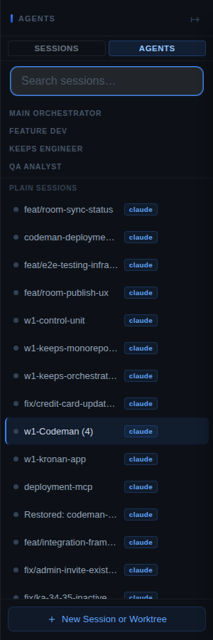
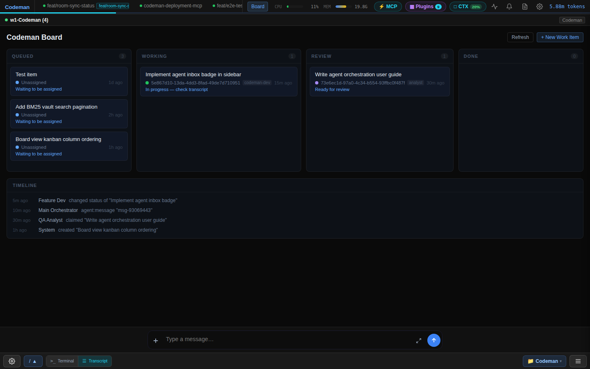
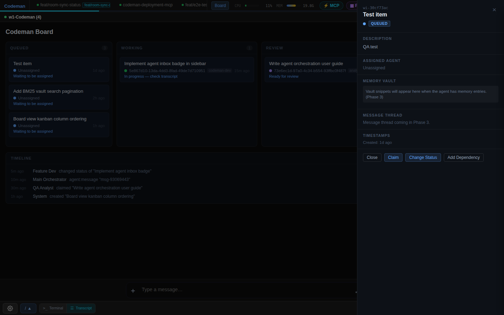
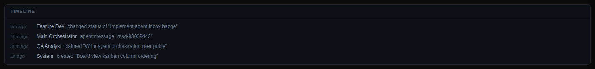

# Agent Orchestration User Guide

Codeman's agent orchestration system lets you define persistent AI agent profiles,
track work items on a shared kanban board, route tasks between agents with a
memory vault that persists context across sessions, and integrate external project
management tools via the Clockwork OS API.

---

## Table of Contents

1. [Getting Started](#getting-started)
2. [Agents](#agents)
3. [Memory Vault](#memory-vault)
4. [Work Items](#work-items)
5. [Board View](#board-view)
6. [Inter-Agent Messaging](#inter-agent-messaging)
7. [Clockwork OS Integration](#clockwork-os-integration)
8. [Complete API Reference](#complete-api-reference)

---

## Getting Started

### What is agent orchestration?

Agent orchestration in Codeman is a coordination layer that sits on top of your AI
coding sessions. Instead of treating every Claude Code session as an isolated
conversation, you define named **agent profiles** with specific roles and capabilities.
Agents share a **work item board** (kanban-style), exchange messages, and each
maintain a private **memory vault** where notes from past sessions are indexed and
retrieved automatically when a new session starts. This lets a team of specialized
AI agents — a feature developer, a QA analyst, a deployment agent, and an orchestrator
— collaborate on the same codebase without losing context between sessions.

### Creating your first agent

```bash
curl -s -X POST http://localhost:3001/api/agents \
  -H "Content-Type: application/json" \
  -d '{
    "role": "codeman-dev",
    "displayName": "Feature Dev",
    "rolePrompt": "Implements features and fixes bugs. Always writes tests alongside code."
  }'
```

Response:

```json
{
  "success": true,
  "data": {
    "agentId": "5e867d10-13da-4dd3-8fad-49de7d710951",
    "role": "codeman-dev",
    "displayName": "Feature Dev",
    "vaultPath": "/home/user/.codeman/vaults/5e867d10-13da-4dd3-8fad-49de7d710951",
    "capabilities": [],
    "rolePrompt": "Implements features and fixes bugs. Always writes tests alongside code.",
    "notesSinceConsolidation": 0,
    "decay": { "notesTtlDays": 90, "patternsTtlDays": 365 },
    "createdAt": "2026-03-24T08:01:47.373Z"
  }
}
```

Save the `agentId` — you will need it to claim work items and send messages.

### The agent sidebar

The Codeman sidebar has two tabs: **Sessions** and **Agents**.

- **Sessions** — the default view; lists all running tmux sessions.
- **Agents** — groups sessions by agent profile, shows inbox badge counts, and
  lists agents that exist in the system even if no session is currently running
  for them.



To switch to the Agents view, click the **Agents** button in the sidebar header.
The preference is saved in `localStorage` and restored on next load.

---

## Agents

### What is an agent vs a session?

A **session** is a live tmux pane running Claude Code (or another AI CLI). It is
ephemeral — when you close it the terminal buffer is gone.

An **agent profile** is a persistent record that defines an AI persona: its role,
its system prompt, its tool capabilities, and its memory vault path. A session can
be **linked** to an agent profile by setting `agentProfile` on the session object,
so that the agent's vault context is automatically injected at session start.

You can have an agent profile with no active session (it will still appear in the
sidebar and can receive messages) or multiple sessions linked to the same agent at
different points in time.

### Agent roles

| Role | Description |
|------|-------------|
| `keeps-engineer` | Manages a specific service backend (APIs, DB, data integrity) |
| `codeman-dev` | Implements features, fixes bugs, authors tests |
| `deployment-agent` | Handles CI/CD, infrastructure, environment configuration |
| `orchestrator` | Coordinates tasks across agents, monitors overall progress |
| `analyst` | Runs test suites, analyses coverage gaps, files defect reports |

### Creating agents via API

```bash
# Minimal required fields
curl -s -X POST http://localhost:3001/api/agents \
  -H "Content-Type: application/json" \
  -d '{
    "role": "orchestrator",
    "displayName": "Main Orchestrator"
  }'
```

**Full body schema:**

| Field | Type | Required | Default | Description |
|-------|------|----------|---------|-------------|
| `role` | string | yes | — | One of the 5 role values |
| `displayName` | string | yes | — | Human-readable name shown in sidebar |
| `rolePrompt` | string | no | `""` | System-level instructions for this agent |
| `capabilities` | array | no | `[]` | MCP and skill capabilities (see below) |
| `decay` | object | no | `{notesTtlDays:90,patternsTtlDays:365}` | Vault note lifetime |

The `vaultPath` is automatically set to `~/.codeman/vaults/<agentId>/` and cannot
be overridden in the create request.

### Agent capabilities and MCPs

Capabilities tell Codeman which MCPs or skills the agent has access to:

```bash
curl -s -X POST http://localhost:3001/api/agents \
  -H "Content-Type: application/json" \
  -d '{
    "role": "deployment-agent",
    "displayName": "Deploy Bot",
    "capabilities": [
      { "name": "filesystem", "type": "mcp", "ref": "mcp-filesystem", "enabled": true },
      { "name": "deploy-skill", "type": "skill", "ref": "codeman-deploy", "enabled": true }
    ]
  }'
```

Capability fields: `name` (display label), `type` (`"mcp"` or `"skill"`),
`ref` (identifier used to load the capability), `enabled` (boolean toggle).

### Updating and deleting agents

```bash
# Update display name and role prompt
curl -s -X PATCH http://localhost:3001/api/agents/<agentId> \
  -H "Content-Type: application/json" \
  -d '{"displayName": "Senior Dev", "rolePrompt": "Always consider backwards compatibility."}'

# Delete an agent (also clears agentProfile from linked sessions)
curl -s -X DELETE http://localhost:3001/api/agents/<agentId>
# → 204 No Content
```

### Viewing agents in the sidebar

After creating agents, open the sidebar and click **Agents**. Agents are grouped by
their `displayName` under role-labelled headers. Each agent row shows an inbox badge
with the unread message count. Click the badge area to expand the inline inbox panel.

---

## Memory Vault

Each agent has a private vault at `~/.codeman/vaults/<agentId>/`. The vault stores
markdown note files captured from sessions and synthesised **pattern** files created
by the consolidation process.

### How automatic capture works

When a Claude Code session ends (the stop hook fires), Codeman automatically calls
`POST /api/agents/:agentId/vault/capture` with the session's output digest. The note
is written as a timestamped markdown file:

```
2026-03-24T08:09:05Z-<sessionIdPrefix>.md
```

Front-matter fields: `capturedAt`, `sessionId`, `workItemId` (if the session was
linked to a work item).

### How retrieval works

At the start of a new session linked to an agent, Codeman performs a BM25 full-text
search over the vault notes most relevant to the current task or work item title. The
top results are injected as a briefing block at the top of the system prompt. This
means the agent "remembers" relevant findings from past sessions without you having
to re-explain context.

### Viewing vault notes

```bash
# List notes (paginated)
curl -s "http://localhost:3001/api/agents/<agentId>/vault/notes?limit=10&offset=0"
```

Response:

```json
{
  "success": true,
  "notes": [
    {
      "filename": "2026-03-24T08:09:05Z-testsess.md",
      "capturedAt": "2026-03-24T08:09:05Z",
      "sessionId": "test-session-001",
      "workItemId": null,
      "content": "---\ncapturedAt: ...\n---\n# Session summary\n...",
      "indexed": true
    }
  ],
  "total": 1
}
```

```bash
# Search vault notes with BM25
curl -s "http://localhost:3001/api/agents/<agentId>/vault/query?q=API+response+parsing&limit=5"
```

Search result fields: `sourceType` (`"note"` or `"pattern"`), `sourceFile`,
`snippet`, `score`, `workItemId`, `timestamp`.

```bash
# Delete a specific note
curl -s -X DELETE "http://localhost:3001/api/agents/<agentId>/vault/notes/2026-03-24T08:09:05Z-testsess.md"
# → 204 No Content
```

### Manual consolidation

Consolidation clusters related notes using TF-IDF similarity and writes synthesised
**pattern** files via the LLM. Patterns describe recurring behaviours, gotchas, or
best practices extracted across multiple sessions and boost BM25 search scores.

Consolidation runs automatically when `notesSinceConsolidation` crosses a threshold,
but you can trigger it manually:

```bash
curl -s -X POST http://localhost:3001/api/agents/<agentId>/vault/consolidate
```

Response:

```json
{
  "success": true,
  "data": {
    "patternsWritten": 2,
    "notesProcessed": 15,
    "notesArchived": 8,
    "patternsDeleted": 0
  }
}
```

### Pattern notes and how they boost search

Pattern files live in `~/.codeman/vaults/<agentId>/patterns/`. Each pattern
represents a cluster of related notes synthesised into a single best-practice
document. During BM25 retrieval, pattern matches are weighted higher than individual
notes because they represent consolidated knowledge. You can list all patterns:

```bash
curl -s "http://localhost:3001/api/agents/<agentId>/vault/patterns"
```

---

## Work Items

Work items are the unit of tracked work on the board. Each item has a unique ID
in the format `wi-<8-char-hash>` derived from the title, source, and creation
timestamp.

### Creating work items

```bash
curl -s -X POST http://localhost:3001/api/work-items \
  -H "Content-Type: application/json" \
  -d '{
    "title": "Implement agent inbox badge in sidebar",
    "description": "Show unread message count badge on each agent row in the Agents sidebar view.",
    "source": "manual"
  }'
```

**Body schema:**

| Field | Type | Required | Description |
|-------|------|----------|-------------|
| `title` | string | yes | Short work item title |
| `description` | string | no | Detailed description |
| `source` | string | no | `manual` \| `asana` \| `github` \| `clockwork` (default: `manual`) |
| `metadata` | object | no | Arbitrary key-value pairs |
| `externalRef` | string | no | Reference ID in external system |
| `externalUrl` | string | no | Link to external ticket |

### Status lifecycle

```
queued → assigned → in_progress → review → done
                ↓
            blocked (has unresolved dependencies)
            cancelled
```

Update status with `PATCH /api/work-items/:id`:

```bash
curl -s -X PATCH http://localhost:3001/api/work-items/wi-c7a546fd \
  -H "Content-Type: application/json" \
  -d '{"status": "in_progress"}'
```

### Claiming work items

Claiming atomically assigns a work item to an agent and transitions status from
`queued` to `assigned`. Returns `409 Conflict` if the item is already claimed.

```bash
curl -s -X POST http://localhost:3001/api/work-items/wi-c7a546fd/claim \
  -H "Content-Type: application/json" \
  -d '{"agentId": "5e867d10-13da-4dd3-8fad-49de7d710951"}'
```

### Ready items

"Ready" items are those with status `queued` and no unresolved blocking
dependencies — i.e. safe to start immediately:

```bash
curl -s http://localhost:3001/api/work-items/ready
```

### The dependency graph

Work items can block each other. Use `POST /api/work-items/:id/dependencies` to
declare that one item must finish before another can start:

```bash
# wi-dcbc58db depends on wi-c7a546fd (must finish first)
curl -s -X POST http://localhost:3001/api/work-items/wi-dcbc58db/dependencies \
  -H "Content-Type: application/json" \
  -d '{"dependsOnId": "wi-c7a546fd"}'

# Remove the dependency
curl -s -X DELETE http://localhost:3001/api/work-items/wi-dcbc58db/dependencies/wi-c7a546fd
```

When a blocking item is still in progress, the dependent item's status shows as
`blocked` in the board.

### Memory decay (auto-cleanup)

Work items are automatically cleaned up after they reach terminal status (`done` or
`cancelled`). The TTL is controlled by the `decay` settings on the agent profile
(`notesTtlDays` and `patternsTtlDays`). Items attached to vault notes are archived
rather than deleted so historical context is preserved.

---

## Board View

The board view provides a live kanban overview of all work items across all agents.



### Opening the board

Click the **Board** button in the Codeman header bar. The terminal and transcript
panels are hidden; the kanban layout takes the full viewport. Click **Board** again
(or any session tab) to return to the terminal view.

### Kanban columns

| Column | Item statuses included |
|--------|----------------------|
| **Queued** | `queued`, `blocked` |
| **Working** | `assigned`, `in_progress` |
| **Review** | `review` |
| **Done** | `done`, `cancelled` |

Each column header shows the item count.

### Work item cards

Cards show:
- **Title** — truncated to fit the card width
- **Status dot** — colour-coded (queued=blue, blocked=red, assigned=amber,
  in_progress=green, review=purple, done/cancelled=grey)
- **Agent name** — who the item is assigned to, or "Unassigned"
- **Role badge** — the agent's role
- **Elapsed time** — time since creation

### Detail panel

Click any card to open the slide-in detail panel. The panel shows all fields of
the work item and provides action buttons: **Claim**, **Change Status**, and
**Add Dependency**.



### Timeline feed

The timeline at the bottom of the board shows a live stream of events across all
agents: status changes, claims, new items created, and messages sent. The feed is
updated in real time via SSE without requiring a page refresh.



---

## Inter-Agent Messaging

Agents communicate through a structured inbox/outbox system. Messages are typed
and can carry vault context, work item references, and arbitrary key-value data.

### Message types

| Type | When to use |
|------|-------------|
| `handoff` | Transfer a work item from one agent to another; automatically includes relevant vault context |
| `briefing` | One-way informational update (e.g. from Clockwork OS) |
| `broadcast` | Sent to all agents simultaneously |
| `status_query` | Ask another agent for a progress update |
| `status_response` | Reply to a status query |
| `escalation` | Flag a blocker that requires human or orchestrator attention |

### Sending a message to a specific agent

```bash
curl -s -X POST http://localhost:3001/api/agents/<toAgentId>/messages \
  -H "Content-Type: application/json" \
  -d '{
    "fromAgentId": "<fromAgentId>",
    "type": "handoff",
    "subject": "Take over the inbox badge work item",
    "body": "I have finished the CSS groundwork. Please implement the fetch logic and wire up the badge counter.",
    "workItemId": "wi-c7a546fd"
  }'
```

**Body schema:**

| Field | Type | Required | Description |
|-------|------|----------|-------------|
| `fromAgentId` | string | yes | Sending agent's ID |
| `type` | string | yes | One of the 6 message types |
| `subject` | string | yes | Short subject line |
| `body` | string | yes | Full message body (markdown) |
| `workItemId` | string | no | Link to a work item |
| `context` | object | no | `{ vaultSnippets, gitHash, extra, workItemId }` |

### Handoff messages and vault context

When `type` is `handoff`, Codeman automatically queries the sending agent's vault for
notes related to the `workItemId` or `subject` and attaches the top results to the
message `context.vaultSnippets`. The receiving agent can use these snippets to pick
up context without re-reading the entire history.

### Broadcasting to all agents

```bash
curl -s -X POST http://localhost:3001/api/agents/broadcast \
  -H "Content-Type: application/json" \
  -d '{
    "fromAgentId": "<agentId>",
    "subject": "Test suite status update",
    "body": "All 1435 tests passing. Coverage at 82%. No regressions.",
    "type": "broadcast"
  }'
```

Note: the path is `/api/agents/broadcast` (not `/api/agents/<id>/broadcast`).

### Reading the inbox

```bash
# Get all unread messages
curl -s "http://localhost:3001/api/agents/<agentId>/inbox?unreadOnly=true&limit=20"

# Mark a message as read
curl -s -X PATCH http://localhost:3001/api/agents/<agentId>/messages/<messageId>/read
```

The sidebar shows a numeric badge on each agent row indicating unread count.
Clicking the row expands an inline inbox panel showing the last 20 messages.

---

## Clockwork OS Integration

The Clockwork OS integration allows an external strategic orchestrator to push work
items into Codeman, register status-change webhooks, and query board state — all
over a token-authenticated REST API.

### Setting up the API token

Set the token in your Codeman config or environment:

```bash
# In ~/.codeman/config.json
{ "clockworkToken": "your-secret-token-here" }

# Or as an environment variable
export CLOCKWORK_API_TOKEN=your-secret-token-here
```

All Clockwork routes require the header `X-Clockwork-Token: <token>`. Requests
without a valid token return `401 Unauthorized`.

### Pushing work items from Clockwork OS

```bash
curl -s -X POST http://localhost:3001/api/clockwork/work-items \
  -H "Content-Type: application/json" \
  -H "X-Clockwork-Token: your-secret-token-here" \
  -d '{
    "title": "Add OAuth2 login flow",
    "description": "Users should be able to log in via GitHub OAuth2.",
    "externalRef": "CW-1042",
    "externalUrl": "https://clockwork.example.com/tasks/CW-1042"
  }'
```

The `source` field is automatically set to `"clockwork"`. The response includes the
new work item with its `wi-` prefixed ID.

### Registering a webhook for status changes

```bash
curl -s -X POST http://localhost:3001/api/clockwork/webhook \
  -H "Content-Type: application/json" \
  -H "X-Clockwork-Token: your-secret-token-here" \
  -d '{
    "url": "https://clockwork.example.com/codeman/webhook",
    "secret": "hmac-signing-secret"
  }'
```

Codeman fires an HTTP POST to the registered URL whenever a work item's status
changes (via `PATCH /api/work-items/:id`). Webhook payload:

```json
{
  "event": "workItem:statusChanged",
  "workItemId": "wi-c7a546fd",
  "status": "in_progress",
  "previousStatus": "assigned",
  "timestamp": "2026-03-24T08:02:10.128Z"
}
```

If a `secret` was registered, the request includes an `X-Webhook-Signature` header
with an HMAC-SHA256 signature of the body.

### Board status summary

```bash
curl -s http://localhost:3001/api/clockwork/status \
  -H "X-Clockwork-Token: your-secret-token-here"
```

```json
{
  "success": true,
  "data": {
    "workItems": {
      "total": 5,
      "byStatus": {
        "queued": 3,
        "in_progress": 1,
        "review": 1
      }
    },
    "agents": {
      "total": 4,
      "active": 1,
      "activeAgents": ["Feature Dev"]
    }
  }
}
```

### Agent suggestion for assignment

```bash
curl -s http://localhost:3001/api/clockwork/work-items/wi-c7a546fd/suggest-agent \
  -H "X-Clockwork-Token: your-secret-token-here"
```

Returns a ranked list of agents suitable for the work item based on role match and
current workload.

### Sending a briefing to an agent

```bash
curl -s -X POST http://localhost:3001/api/clockwork/agents/<agentId>/briefing \
  -H "Content-Type: application/json" \
  -H "X-Clockwork-Token: your-secret-token-here" \
  -d '{
    "subject": "Sprint priorities for March 24",
    "body": "Focus on authentication work items first. Defer refactoring tasks."
  }'
```

---

## Complete API Reference

### Agent CRUD

| Method | Path | Auth | Description |
|--------|------|------|-------------|
| `GET` | `/api/agents` | none | List all agent profiles |
| `GET` | `/api/agents/:agentId` | none | Get single agent (404 if not found) |
| `POST` | `/api/agents` | none | Create agent — body: `{ role, displayName, rolePrompt?, capabilities?, decay? }` — returns 201 |
| `PATCH` | `/api/agents/:agentId` | none | Update displayName, rolePrompt, capabilities, decay |
| `DELETE` | `/api/agents/:agentId` | none | Delete agent; clears agentProfile from linked sessions — returns 204 |

### Vault

| Method | Path | Auth | Description |
|--------|------|------|-------------|
| `POST` | `/api/agents/:agentId/vault/capture` | none | Capture note — body: `{ sessionId, content, workItemId? }` |
| `GET` | `/api/agents/:agentId/vault/query` | none | BM25 search — `?q=<text>&limit=5` (max 20) |
| `GET` | `/api/agents/:agentId/vault/notes` | none | List notes — `?limit=50&offset=0` (max 200) |
| `DELETE` | `/api/agents/:agentId/vault/notes/:filename` | none | Delete note by filename — returns 204 |
| `POST` | `/api/agents/:agentId/vault/consolidate` | none | Trigger manual consolidation |
| `GET` | `/api/agents/:agentId/vault/patterns` | none | List all pattern files |

### Work Items

| Method | Path | Auth | Description |
|--------|------|------|-------------|
| `GET` | `/api/work-items` | none | List all — `?status=queued&agentId=<id>` (both optional) |
| `GET` | `/api/work-items/ready` | none | Items with `status=queued` and no unresolved blocking deps |
| `POST` | `/api/work-items` | none | Create — body: `{ title, description?, source?, metadata?, externalRef?, externalUrl? }` — returns 201 |
| `GET` | `/api/work-items/:id` | none | Get single item (404 if missing) |
| `PATCH` | `/api/work-items/:id` | none | Update any field; fires webhook on status change |
| `POST` | `/api/work-items/:id/claim` | none | Atomic claim — body: `{ agentId }` — 409 if already claimed |
| `POST` | `/api/work-items/:id/dependencies` | none | Add dependency — body: `{ dependsOnId }` |
| `DELETE` | `/api/work-items/:id/dependencies/:depId` | none | Remove dependency |

### Inter-Agent Messaging

| Method | Path | Auth | Description |
|--------|------|------|-------------|
| `POST` | `/api/agents/broadcast` | none | Broadcast to ALL agents — body: `{ fromAgentId, subject, body, workItemId?, type? }` — returns 201 |
| `POST` | `/api/agents/:agentId/messages` | none | Send to specific agent — body: `{ fromAgentId, type, subject, body, workItemId?, context? }` — returns 201 |
| `GET` | `/api/agents/:agentId/inbox` | none | Get inbox — `?unreadOnly=true&limit=20&offset=0` |
| `GET` | `/api/agents/:agentId/messages/:messageId` | none | Get single message |
| `PATCH` | `/api/agents/:agentId/messages/:messageId/read` | none | Mark message as read |

### Clockwork OS Integration

All Clockwork routes require `X-Clockwork-Token` header.

| Method | Path | Auth | Description |
|--------|------|------|-------------|
| `POST` | `/api/clockwork/webhook` | token | Register/update callback URL — body: `{ url, secret? }` |
| `POST` | `/api/clockwork/work-items` | token | Push work item (same body as `/api/work-items`, defaults `source='clockwork'`) |
| `GET` | `/api/clockwork/status` | token | Board summary: work item counts by status + active agents |
| `POST` | `/api/clockwork/broadcast` | token | Broadcast to all agents from `clockwork-os` sender |
| `POST` | `/api/clockwork/agents/:id/briefing` | token | Send `briefing` type message to specific agent |
| `GET` | `/api/clockwork/work-items/:id/suggest-agent` | token | Ranked agent suggestions for a work item |

### SSE Events

Codeman pushes real-time updates to connected browser clients via Server-Sent
Events. The board and sidebar listen for these events to update without polling:

| Event | Trigger |
|-------|---------|
| `workItem:created` | New work item via POST |
| `workItem:updated` | Any field change via PATCH |
| `workItem:claimed` | Claim endpoint called |
| `workItem:statusChanged` | Status field updated |
| `workItem:completed` | Status set to `done` or `cancelled` |
| `agent:created` | New agent profile created |
| `agent:updated` | Agent profile patched |
| `agent:deleted` | Agent profile deleted |
| `agent:message` | Message sent to an agent |
| `agent:broadcast` | Broadcast message sent |
| `vault:consolidateComplete` | Consolidation finished |
| `clockwork:workItemPushed` | Clockwork pushed a work item |
| `clockwork:briefingSent` | Clockwork sent a briefing |
