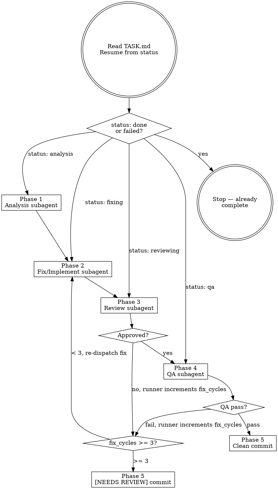

# Codeman Task Workflow Implementation Plan

> **For agentic workers:** REQUIRED: Use superpowers:subagent-driven-development (if subagents available) or superpowers:executing-plans to implement this plan. Steps use checkbox (`- [ ]`) syntax for tracking.

**Goal:** Create three skill files (`codeman-fix`, `codeman-feature`, `codeman-task-runner`) that implement an autonomous bug-fix and feature-implementation workflow in Codeman worktree sessions.

**Architecture:** Two thin intake skills call the Codeman API to create a worktree, then immediately write `TASK.md` + `CLAUDE.md` to the returned `worktreePath`. The session starts via `autoStart: true` and the runner skill executes autonomously inside the worktree, dispatching fresh subagents for each phase (analysis → fix → review loop → QA → commit). `TASK.md` is the persistent state anchor; `CLAUDE.md` is the compact/clear recovery guard.

**Tech Stack:** Markdown skill files. No code. Codeman API on port 3001. Patterns follow existing `codeman-worktrees` and `codeman-merge-worktree` skills.

**Spec:** `docs/superpowers/specs/2026-03-14-codeman-task-workflow-design.md`

**Important — file write ordering:** You cannot pre-create the worktree directory because `git worktree add` requires the target path to not exist. The correct order is: (1) call the API with `autoStart: true` to create the worktree and get back `worktreePath`, (2) immediately write `TASK.md` and `CLAUDE.md` to `worktreePath`. The Claude process starts with `autoStart` but takes a moment to initialize and read its initial prompt — writing the files immediately after the API response wins this in practice.

---

## File Structure

| Action | Path | Purpose |
|--------|------|---------|
| Create | `skills/codeman-fix/SKILL.md` | Bug-fix intake skill (source) |
| Create | `~/.claude/skills/codeman-fix/SKILL.md` | Bug-fix intake skill (user copy) |
| Create | `skills/codeman-feature/SKILL.md` | Feature intake skill (source) |
| Create | `~/.claude/skills/codeman-feature/SKILL.md` | Feature intake skill (user copy) |
| Create | `skills/codeman-task-runner/SKILL.md` | Runner skill (source) |
| Create | `~/.claude/skills/codeman-task-runner/SKILL.md` | Runner skill (user copy) |

**Why two copies?** `skills/` in the repo is the authoritative source. `~/.claude/skills/` is where Claude Code auto-discovers skills at runtime. Both must be kept identical — this matches the existing `codeman-worktrees` pattern.

---

## Chunk 1: `codeman-fix` Intake Skill

### Task 1: Create `codeman-fix` skill

**Files:**
- Create: `skills/codeman-fix/SKILL.md`
- Create: `~/.claude/skills/codeman-fix/SKILL.md`

- [ ] **Step 1: Create source directory**

```bash
mkdir -p skills/codeman-fix
```

- [ ] **Step 2: Write `skills/codeman-fix/SKILL.md`**

Write the following content exactly:

```markdown
---
name: codeman-fix
description: Use when user wants to fix a bug, debug an issue, or investigate a problem. Triggers on phrases like "fix this bug", "there's a bug with X", "debug X", "investigate X".
---

# Codeman Bug Fix — Intake

## Overview

Prepare a Codeman worktree session for autonomous bug fixing. Creates a worktree via API, then writes `TASK.md` and `CLAUDE.md` to the returned worktree path. The session runs the full fix → review → QA workflow autonomously via the `codeman-task-runner` skill. Base URL: `http://localhost:3001`.

## Step 1 — Collect Inputs

Ask the user (in one message) for everything missing:
- **Title** — one-line summary of the bug (e.g. "hamburger menu blocked by overlay on mobile")
- **Description** — free-text details: what happens, what was expected, any context

If the user already provided these in the invocation, skip asking.

Also ask or infer:
- **Target project** — which repo? (ask if not obvious from context, or infer from current session's `workingDir`)

## Step 2 — Find Parent Session

```bash
curl -s http://localhost:3001/api/sessions
```

Filter for sessions where `worktreeBranch` is null/absent (main sessions only, not sub-worktrees). Match `workingDir` against the project name (case-insensitive). Prefer `status: idle` over `busy`; prefer shorter `workingDir` (closer to repo root).

If no match found, list sessions and ask the user which session to use.

## Step 3 — Generate Branch Name

Slug the title: lowercase, replace spaces/special chars with hyphens, max 40 chars.

Branch name: `fix/<slug>`

Examples:
- "hamburger menu blocked by overlay" → `fix/hamburger-menu-blocked-by-overlay`
- "Session crash on respawn" → `fix/session-crash-on-respawn`

## Step 4 — Create Worktree via API

```bash
curl -s -X POST http://localhost:3001/api/sessions/SESSION_ID/worktree \
  -H "Content-Type: application/json" \
  -d '{
    "branch": "fix/<slug>",
    "isNew": true,
    "notes": "Read TASK.md in this directory, then invoke the codeman-task-runner skill.",
    "autoStart": true
  }'
```

The `notes` field is just this short trigger sentence — the full task description lives in `TASK.md`.

**Success response:** `{ success: true, session: {...}, worktreePath: "/absolute/path/to/worktree" }`

**Error handling:**
- `NOT_FOUND` → ask user to confirm the project name and retry with the correct session ID.
- `INVALID_INPUT` with "branch already exists" → append `-2` to the slug and retry (e.g. `fix/my-bug-2`).
- `INVALID_INPUT` other → fix the branch name (no spaces, valid git ref characters only).
- `OPERATION_FAILED` → report the full error message and stop.

## Step 5 — Write TASK.md and CLAUDE.md

**Immediately** after the API call returns, write both files to `worktreePath` from the response. Do this before anything else — the session is already starting.

**Write `<worktreePath>/TASK.md`:**

```markdown
# Task

type: bug
status: analysis
title: <title from Step 1>
description: <full description from Step 1>
affected_area: unknown
fix_cycles: 0

## Reproduction
<!-- filled by analysis subagent -->

## Root Cause / Spec
<!-- filled by analysis subagent -->

## Fix / Implementation Notes
<!-- filled by fix subagent -->

## Review History
<!-- appended by each review subagent — never overwrite -->

## QA Results
<!-- filled by QA subagent -->

## Decisions & Context
<!-- append-only log of key decisions made during the workflow -->
```

**Write `<worktreePath>/CLAUDE.md`:**

```markdown
You are working autonomously in a Codeman worktree.
Before doing ANYTHING else, re-read `TASK.md` in this directory
and resume from the phase in `status`.
Do not rely on conversation history.
Then invoke the codeman-task-runner skill.
```

## Step 6 — Report

Summarize what was created:
- Branch: `fix/<slug>`
- Worktree: `<worktreePath>`
- Session: link or name from API response
- Status: session started, running autonomously

---

## Common Mistakes

| Mistake | Fix |
|---------|-----|
| Putting full description in `notes` | `notes` is just the short trigger sentence; full description goes in TASK.md |
| Delaying TASK.md write | Write immediately after API returns — the session is already starting |
| Using a worktree session as parent | Filter for `worktreeBranch: null` sessions only |
| Wrong port | Codeman runs on **3001**, not 3000 |
| Branch name with spaces | Use hyphens only, max 40 chars |
```

- [ ] **Step 3: Verify the file has correct frontmatter and all 6 steps**

```bash
head -5 skills/codeman-fix/SKILL.md
grep -c "^## Step" skills/codeman-fix/SKILL.md
```

Expected: frontmatter with `name: codeman-fix`, output `6`.

- [ ] **Step 4: Copy to user skills directory**

```bash
mkdir -p ~/.claude/skills/codeman-fix
cp skills/codeman-fix/SKILL.md ~/.claude/skills/codeman-fix/SKILL.md
diff skills/codeman-fix/SKILL.md ~/.claude/skills/codeman-fix/SKILL.md && echo "IDENTICAL"
```

Expected: `IDENTICAL`

- [ ] **Step 5: Commit**

```bash
git add skills/codeman-fix/SKILL.md
git commit -m "feat(skill): add codeman-fix intake skill for autonomous bug-fix workflow"
```

---

## Chunk 2: `codeman-feature` Intake Skill

### Task 2: Create `codeman-feature` skill

**Files:**
- Create: `skills/codeman-feature/SKILL.md`
- Create: `~/.claude/skills/codeman-feature/SKILL.md`

- [ ] **Step 1: Create source directory**

```bash
mkdir -p skills/codeman-feature
```

- [ ] **Step 2: Write `skills/codeman-feature/SKILL.md`**

Write the following content exactly:

```markdown
---
name: codeman-feature
description: Use when user wants to implement a feature, add new functionality, or build something new. Triggers on phrases like "implement X", "add feature X", "build X", "I need X".
---

# Codeman Feature — Intake

## Overview

Prepare a Codeman worktree session for autonomous feature implementation. Creates a worktree via API, then writes `TASK.md` and `CLAUDE.md` to the returned worktree path. The session runs the full implement → review → QA workflow autonomously via the `codeman-task-runner` skill. Base URL: `http://localhost:3001`.

## Step 1 — Collect Inputs

Ask the user (in one message) for everything missing:
- **Title** — one-line summary of the feature (e.g. "add dark mode toggle to settings panel")
- **Description** — free-text details: what it should do, user-facing behaviour
- **Constraints or acceptance criteria** — any must-haves or must-nots (optional but ask)

If the user already provided these in the invocation, skip asking.

Also ask or infer:
- **Target project** — which repo? (ask if not obvious from context, or infer from current session's `workingDir`)

## Step 2 — Find Parent Session

```bash
curl -s http://localhost:3001/api/sessions
```

Filter for sessions where `worktreeBranch` is null/absent (main sessions only, not sub-worktrees). Match `workingDir` against the project name (case-insensitive). Prefer `status: idle` over `busy`; prefer shorter `workingDir` (closer to repo root).

If no match found, list sessions and ask the user which session to use.

## Step 3 — Generate Branch Name

Slug the title: lowercase, replace spaces/special chars with hyphens, max 40 chars.

Branch name: `feat/<slug>`

Examples:
- "add dark mode toggle to settings panel" → `feat/dark-mode-toggle`
- "implement rate limiting for API endpoints" → `feat/api-rate-limiting`

## Step 4 — Create Worktree via API

```bash
curl -s -X POST http://localhost:3001/api/sessions/SESSION_ID/worktree \
  -H "Content-Type: application/json" \
  -d '{
    "branch": "feat/<slug>",
    "isNew": true,
    "notes": "Read TASK.md in this directory, then invoke the codeman-task-runner skill.",
    "autoStart": true
  }'
```

The `notes` field is just this short trigger sentence — the full task description lives in `TASK.md`.

**Success response:** `{ success: true, session: {...}, worktreePath: "/absolute/path/to/worktree" }`

**Error handling:**
- `NOT_FOUND` → ask user to confirm the project name and retry with the correct session ID.
- `INVALID_INPUT` with "branch already exists" → append `-2` to the slug and retry (e.g. `feat/my-feature-2`).
- `INVALID_INPUT` other → fix the branch name (no spaces, valid git ref characters only).
- `OPERATION_FAILED` → report the full error message and stop.

## Step 5 — Write TASK.md and CLAUDE.md

**Immediately** after the API call returns, write both files to `worktreePath` from the response. Do this before anything else — the session is already starting.

**Write `<worktreePath>/TASK.md`:**

```markdown
# Task

type: feature
status: analysis
title: <title from Step 1>
description: <full description from Step 1>
constraints: <constraints/acceptance criteria from Step 1, or "none specified">
affected_area: unknown
fix_cycles: 0

## Root Cause / Spec
<!-- filled by analysis subagent -->

## Fix / Implementation Notes
<!-- filled by implement subagent -->

## Review History
<!-- appended by each review subagent — never overwrite -->

## QA Results
<!-- filled by QA subagent -->

## Decisions & Context
<!-- append-only log of key decisions made during the workflow -->
```

**Write `<worktreePath>/CLAUDE.md`:**

```markdown
You are working autonomously in a Codeman worktree.
Before doing ANYTHING else, re-read `TASK.md` in this directory
and resume from the phase in `status`.
Do not rely on conversation history.
Then invoke the codeman-task-runner skill.
```

## Step 6 — Report

Summarize what was created:
- Branch: `feat/<slug>`
- Worktree: `<worktreePath>`
- Session: link or name from API response
- Status: session started, running autonomously

---

## Common Mistakes

| Mistake | Fix |
|---------|-----|
| Putting full description in `notes` | `notes` is just the short trigger sentence; full description goes in TASK.md |
| Delaying TASK.md write | Write immediately after API returns — the session is already starting |
| Using a worktree session as parent | Filter for `worktreeBranch: null` sessions only |
| Wrong port | Codeman runs on **3001**, not 3000 |
| Branch name with spaces | Use hyphens only, max 40 chars |
```

- [ ] **Step 3: Verify the file**

```bash
head -5 skills/codeman-feature/SKILL.md
grep -c "^## Step" skills/codeman-feature/SKILL.md
```

Expected: frontmatter with `name: codeman-feature`, output `6`.

- [ ] **Step 4: Copy to user skills directory**

```bash
mkdir -p ~/.claude/skills/codeman-feature
cp skills/codeman-feature/SKILL.md ~/.claude/skills/codeman-feature/SKILL.md
diff skills/codeman-feature/SKILL.md ~/.claude/skills/codeman-feature/SKILL.md && echo "IDENTICAL"
```

Expected: `IDENTICAL`

- [ ] **Step 5: Commit**

```bash
git add skills/codeman-feature/SKILL.md
git commit -m "feat(skill): add codeman-feature intake skill for autonomous feature workflow"
```

---

## Chunk 3: `codeman-task-runner` Runner Skill

### Task 3: Create `codeman-task-runner` skill

**Files:**
- Create: `skills/codeman-task-runner/SKILL.md`
- Create: `~/.claude/skills/codeman-task-runner/SKILL.md`

- [ ] **Step 1: Create source directory**

```bash
mkdir -p skills/codeman-task-runner
```

- [ ] **Step 2: Write `skills/codeman-task-runner/SKILL.md`**

Write the following content exactly:

```markdown
---
name: codeman-task-runner
description: Autonomous task runner for Codeman worktree sessions. Executes the full analysis → fix/implement → review → QA → commit workflow. Triggers on "run the task workflow", "resume task", "continue task from TASK.md". Also invoked automatically via worktree session autoStart and CLAUDE.md reload after compact/clear.
---

# Codeman Task Runner

## Overview

Run the full autonomous task workflow inside a Codeman worktree session. Reads `TASK.md` in the current directory to determine task type, current phase, and all prior context. Dispatches fresh subagents for each phase. Updates `TASK.md` after every phase so the workflow survives context compaction and session resets.

**First action (always):** Re-read `TASK.md` before doing anything else. Resume from the `status` field. Do not rely on conversation history.

**If `status` is `done` or `failed`:** Output a short message ("Task already completed — status: <status>. See TASK.md for results.") and stop. Do not re-run a completed task.

## Workflow



## Phase 1 — Analysis

Dispatch a fresh subagent with this prompt (substitute TASK.md content):

> "You are the Analysis subagent for an autonomous Codeman task workflow.
>
> **TASK.md content:**
> <paste full TASK.md here>
>
> **Your job:**
> 1. Read the description and explore the codebase to understand the affected area.
> 2. For bugs: attempt to reproduce the issue. Document exact reproduction steps. Identify root cause hypothesis.
>    For features: gather implicit constraints from existing code. Draft a minimal implementation spec.
> 3. Determine `affected_area`: `backend` | `frontend` | `logic`. Use `unknown` only if genuinely ambiguous.
> 4. Update `TASK.md`:
>    - Fill in the `## Reproduction` section (bugs only) with your reproduction steps.
>    - Fill in the `## Root Cause / Spec` section with your root cause hypothesis (bugs) or implementation spec (features).
>    - Update the `affected_area` field.
>    - Change `status` from `analysis` to `fixing`.
>
> Do not implement anything. Analysis only."

After subagent completes, verify TASK.md `status` is now `fixing` before proceeding.

## Phase 2 — Fix / Implement

Dispatch a fresh subagent with this prompt:

> "You are the Fix subagent for an autonomous Codeman task workflow.
>
> **TASK.md content:**
> <paste full TASK.md here>
>
> **Your job:**
> 1. Read the task description and analysis findings in TASK.md.
> 2. Implement the minimal fix or feature. Stay focused — no unrelated cleanup or refactoring.
> 3. Document key decisions in the '## Decisions & Context' section of TASK.md (append, never overwrite).
> 4. Update the '## Fix / Implementation Notes' section with what you changed and why.
> 5. Change `status` from `fixing` to `reviewing`.
>
> Keep changes minimal and focused on what TASK.md describes."

After subagent completes, verify TASK.md `status` is now `reviewing` before proceeding.

## Phase 3 — Review Loop

Dispatch a fresh subagent with this prompt:

> "You are the Review subagent for an autonomous Codeman task workflow.
>
> **TASK.md content:**
> <paste full TASK.md here>
>
> **Git diff:**
> <paste output of `git diff HEAD` here>
>
> **Your job:**
> 1. Review the changes against the task description. Be a strict but fair code reviewer.
> 2. Check: correctness, edge cases, TypeScript strictness (no implicit any, unused vars), security, consistency with existing patterns.
> 3. Give your verdict:
>    - **APPROVED** — changes look good, ready for QA
>    - **REJECTED** — list specific, actionable issues (no vague feedback)
> 4. Append your review to the '## Review History' section of TASK.md in this format:
>    ### Review attempt <N> — <APPROVED|REJECTED>
>    <your findings>
> 5. If APPROVED: change `status` to `qa`.
>    If REJECTED: leave `status` as `reviewing`.
>
> IMPORTANT: Do NOT modify the `fix_cycles` field — the runner does that.
> Do not modify any source files. Review only."

After subagent completes, read TASK.md `status`:
- `qa` → proceed to Phase 4
- `reviewing` → **runner** increments `fix_cycles` in TASK.md, then checks limit:
  - `fix_cycles < 3` → re-dispatch Phase 2 (Fix)
  - `fix_cycles >= 3` → proceed to Phase 5 `[NEEDS REVIEW]` path

## Phase 4 — QA

Dispatch a fresh subagent with this prompt:

> "You are the QA subagent for an autonomous Codeman task workflow.
>
> **TASK.md content:**
> <paste full TASK.md here>
>
> **Your job:**
> Run quality checks on the current implementation and report results.
>
> **Always run:**
> 1. `tsc --noEmit` — TypeScript typecheck. Must pass with zero errors.
> 2. `npm run lint` — ESLint. Must pass.
>
> **Targeted check based on `affected_area`:**
> - `backend` → start the dev server (`npx tsx src/index.ts web --port 3099`), curl the affected endpoint, verify the response matches expected behaviour, kill the server.
> - `frontend` → use Playwright to load the page with `waitUntil: 'domcontentloaded'`, wait 3–4 seconds for async data, assert the UI change is visible and correct.
> - `logic` → run the relevant vitest test file: `npx vitest run test/<file>.test.ts`
> - `unknown` → run only typecheck + lint (no targeted check).
>
> **After all checks:**
> Update the '## QA Results' section of TASK.md with pass/fail status for each check run and any error output.
> - All pass → change `status` to `done`
> - Any fail → change `status` back to `fixing`
>
> IMPORTANT: Do NOT modify the `fix_cycles` field — the runner does that."

After subagent completes, read TASK.md `status`:
- `done` → proceed to Phase 5 (clean commit path)
- `fixing` → **runner** increments `fix_cycles`, then checks limit:
  - `fix_cycles < 3` → re-dispatch Phase 2 (Fix)
  - `fix_cycles >= 3` → proceed to Phase 5 `[NEEDS REVIEW]` path

## Phase 5 — Commit & Report

**Clean path (QA passed, status: done):**

```bash
git add -A
git commit -m "fix(<affected_area>): <title>"
# or for features:
git commit -m "feat(<affected_area>): <title>"
```

Output to terminal:
```
✓ Task complete.
Branch: <branch-name>
Commit: <hash>
Summary: <one paragraph from Fix/Implementation Notes>
```

**`[NEEDS REVIEW]` path (fix_cycles >= 3):**

```bash
git add -A
git commit -m "[NEEDS REVIEW]: fix(<affected_area>): <title>

Review history:
<paste Review History section from TASK.md>

QA results:
<paste QA Results section from TASK.md>"
```

Update TASK.md `status` → `failed`.

Output to terminal:
```
⚠ NEEDS HUMAN REVIEW — fix_cycles limit reached.
Branch: <branch-name>
Commit: <hash> (committed with warnings)
See TASK.md Review History for details.
```

## Context Safety Rule

If you detect that context has been lost (e.g., after `/compact` or `/clear`):
1. Re-read `TASK.md` from disk
2. Resume from the `status` field
3. Never start from scratch — always trust TASK.md over conversation history

The `CLAUDE.md` in this directory will have already triggered this rule before you read it. This is intentional.

---

## Common Mistakes

| Mistake | Fix |
|---------|-----|
| Relying on conversation history after compact | Always re-read TASK.md first |
| Dispatching subagents without pasting TASK.md | Each subagent gets full TASK.md content — no shared context |
| Incrementing fix_cycles inside a subagent | The runner (not subagents) increments fix_cycles — subagent prompts say so explicitly |
| Starting from scratch after a restart | Check TASK.md status — resume from current phase |
| Re-running a completed task | If status is `done` or `failed`, output a message and stop |
| Skipping TASK.md update after a phase | Update TASK.md before dispatching next subagent — it's the only persistent state |
```

- [ ] **Step 3: Verify the file has correct structure**

```bash
head -5 skills/codeman-task-runner/SKILL.md
grep -c "^## Phase" skills/codeman-task-runner/SKILL.md
```

Expected: frontmatter with `name: codeman-task-runner`, output `5`.

- [ ] **Step 4: Copy to user skills directory**

```bash
mkdir -p ~/.claude/skills/codeman-task-runner
cp skills/codeman-task-runner/SKILL.md ~/.claude/skills/codeman-task-runner/SKILL.md
diff skills/codeman-task-runner/SKILL.md ~/.claude/skills/codeman-task-runner/SKILL.md && echo "IDENTICAL"
```

Expected: `IDENTICAL`

- [ ] **Step 5: Commit**

```bash
git add skills/codeman-task-runner/SKILL.md
git commit -m "feat(skill): add codeman-task-runner shared runner skill"
```

---

## Chunk 4: Final Verification

### Task 4: Verify all skills and commit plan doc

**Files:**
- No changes to existing files (skills are auto-discovered from `~/.claude/skills/` — no CLAUDE.md update needed)

- [ ] **Step 1: Verify all six skill files exist**

```bash
ls skills/codeman-fix/SKILL.md skills/codeman-feature/SKILL.md skills/codeman-task-runner/SKILL.md
ls ~/.claude/skills/codeman-fix/SKILL.md ~/.claude/skills/codeman-feature/SKILL.md ~/.claude/skills/codeman-task-runner/SKILL.md
```

Expected: all 6 paths listed with no errors.

- [ ] **Step 2: Verify all copies are identical to source**

```bash
diff skills/codeman-fix/SKILL.md ~/.claude/skills/codeman-fix/SKILL.md && \
diff skills/codeman-feature/SKILL.md ~/.claude/skills/codeman-feature/SKILL.md && \
diff skills/codeman-task-runner/SKILL.md ~/.claude/skills/codeman-task-runner/SKILL.md && \
echo "ALL IDENTICAL"
```

Expected: `ALL IDENTICAL`

- [ ] **Step 3: Verify all three skills have correct frontmatter names**

```bash
grep "^name:" skills/codeman-fix/SKILL.md skills/codeman-feature/SKILL.md skills/codeman-task-runner/SKILL.md
```

Expected:
```
skills/codeman-fix/SKILL.md:name: codeman-fix
skills/codeman-feature/SKILL.md:name: codeman-feature
skills/codeman-task-runner/SKILL.md:name: codeman-task-runner
```

- [ ] **Step 4: Commit the plan document**

```bash
git add docs/superpowers/plans/2026-03-14-codeman-task-workflow.md
git commit -m "docs(plan): codeman task workflow implementation plan"
```
