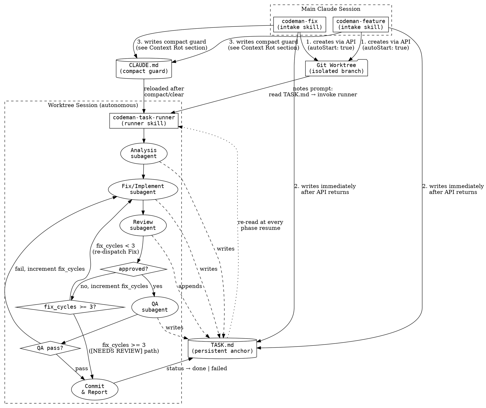

# Codeman Task Workflow — Design Spec

**Date:** 2026-03-14
**Status:** Approved
**Scope:** Two intake skills + one shared runner skill for autonomous bug-fix and feature-implementation workflows in Codeman worktrees.

---

## Problem

Working on multiple parallel tasks in Codeman today requires manually creating a worktree, manually driving the investigation, fix, review, and QA phases, and losing context when the session compacts or resets. There is no automated workflow that takes a task from intake to a reviewable commit without human intervention at every step.

---

## Goals

1. Accept a free-text bug description or feature request and produce a clean, reviewed, tested commit — autonomously.
2. Run in a Codeman worktree session so the main session stays free for other work.
3. Survive context compaction and session resets without losing the thread.
4. Enforce a review loop (max 3 fix cycles) before committing, with graceful failure handling.
5. Apply targeted QA (typecheck + lint + area-specific verification) before every commit.

---

## Architecture

Three skill files with a two-layer design: thin intake skills that prepare and hand off, and a shared runner that executes the full workflow autonomously inside the worktree session.



---

## Context Rot Protection

Two mechanisms work together:

**1. `TASK.md` — persistent phase anchor**
Written to the worktree root at creation. Updated at the end of every phase. Each subagent's first action is to re-read it. If the session compacts or Claude restarts, the runner picks up from `status` in `TASK.md` — no reliance on conversation history.

**2. Worktree `CLAUDE.md` — compact/clear guard**
Written to the worktree root at creation. Claude Code auto-reloads `CLAUDE.md` after `/compact` and `/clear`. Both intake skills write the following exact content to `CLAUDE.md` in the worktree directory:

```
You are working autonomously in a Codeman worktree.
Before doing ANYTHING else, re-read `TASK.md` in this directory
and resume from the phase in `status`.
Do not rely on conversation history.
Then invoke the codeman-task-runner skill.
```

**How the two mechanisms interact:**
- The `notes` field in the API call fires the initial prompt exactly once (Codeman's `_initialPromptSent` flag prevents re-injection after the first spawn).
- All subsequent recovery after compact/clear/restart relies exclusively on `CLAUDE.md`. This is correct and intentional — `CLAUDE.md` is the only recovery path after initial startup.

---

## TASK.md Structure

```markdown
# Task

type: bug | feature
status: analysis | fixing | reviewing | qa | done | failed
title: <one-line summary>
description: <free text from user>
affected_area: backend | frontend | logic | unknown
fix_cycles: 0

## Reproduction (bugs only)
<!-- filled by analysis subagent -->

## Root Cause / Spec
<!-- filled by analysis subagent -->

## Fix / Implementation Notes
<!-- filled by fix/implement subagent -->

## Review History
<!-- appended by each review subagent — never overwrite -->

## QA Results
<!-- filled by QA subagent -->

## Decisions & Context
<!-- append-only log of key decisions made during the workflow -->
```

**`fix_cycles` counter:** Incremented each time the Fix subagent is dispatched — whether triggered by a reviewer rejection or a QA failure. This is the unified fix-cycle counter. The loop exits when `fix_cycles >= 3`, regardless of whether the trigger was review or QA failure.

---

## Phase Definitions

### Phase 1 — Analysis

**Subagent job:**
- Read `TASK.md` description
- Explore the codebase to understand the affected area
- **Bugs:** attempt to reproduce the issue; document reproduction steps; identify root cause hypothesis
- **Features:** gather implicit constraints from existing code; draft a minimal spec
- Determine `affected_area`: `backend` | `frontend` | `logic`. If genuinely ambiguous, set `unknown`.

**Writes to TASK.md:** Reproduction section (bugs), Root Cause / Spec section, `affected_area` field
**Updates status:** `analysis` → `fixing`

---

### Phase 2 — Fix / Implement

**Subagent job:**
- Read `TASK.md` (analysis outputs + full description)
- Implement the fix or feature in the worktree
- Keep changes minimal and focused — no unrelated cleanup
- Document key decisions in the Decisions & Context section

**Writes to TASK.md:** Fix / Implementation Notes
**Updates status:** `fixing` → `reviewing`

---

### Phase 3 — Review Loop

**Subagent job (fresh context each attempt):**
- Read `TASK.md` + `git diff` of changes
- Approve or flag specific issues (no vague feedback)
- If approved: proceed to QA
- If issues found: append rejection to Review History; runner increments `fix_cycles` and re-dispatches Fix subagent

**Writes to TASK.md:** Appends one entry to Review History per attempt

**Loop exit conditions:**
- Reviewer approves → status → `qa`
- `fix_cycles >= 3` → trigger `[NEEDS REVIEW]` commit path (see Failure Handling below)

---

### Phase 4 — QA

**Subagent job:**
- Always run: `tsc --noEmit` + `npm run lint`
- Then targeted verification based on `affected_area`:
  - `backend` → `curl` the affected endpoint and verify response
  - `frontend` → Playwright: load page with `waitUntil: 'domcontentloaded'`, wait 3–4s, assert UI renders correctly
  - `logic` → run the relevant vitest test file(s)
  - `unknown` → run only `tsc --noEmit` + `npm run lint` (no targeted check)
- If any check fails: append failure details to QA Results; runner increments `fix_cycles` and re-dispatches Fix subagent (same `fix_cycles` counter as review failures)

**Writes to TASK.md:** QA Results section with pass/fail details per check
**Updates status:** `qa` → `done` (all pass) or back to `fixing` (any fail)

---

### Phase 5 — Commit & Report

**Normal path (all checks pass):**
- Commit message: `fix(<area>): <title>` or `feat(<area>): <title>`
- Update `TASK.md` status → `done`
- Output to session terminal: branch name, commit hash, summary of what was done

**`[NEEDS REVIEW]` path (`fix_cycles >= 3`):**
- Commit current state as-is
- Commit message prefixed with `[NEEDS REVIEW]: fix(<area>): <title>`
- Commit body includes: all reviewer rejections from Review History, final QA results
- Update `TASK.md` status → `failed`
- Output to session terminal: `⚠ NEEDS HUMAN REVIEW — fix_cycles limit reached. Branch: <name>. See TASK.md Review History for details.`
- The Codeman session terminal message serves as the escalation to the human — no other mechanism needed

---

## Skill File Specs

### `codeman-fix` (intake)

**Trigger phrases:** "fix this bug", "there's a bug with X", "debug X", "investigate X"

**Steps:**
1. Collect title + free-text description (ask if not provided in invocation)
2. Identify target repo/project (ask or infer from current session's `workingDir`)
3. Find parent session via `GET http://localhost:3001/api/sessions` — filter for sessions where `worktreeBranch` is null, match by `workingDir`
4. Generate branch name: `fix/<kebab-slug-from-title>`
5. Compose `TASK.md` content (type: bug, status: analysis, fix_cycles: 0)
6. Compose `CLAUDE.md` content — use the exact text from the Context Rot Protection section above
7. Create worktree via `POST http://localhost:3001/api/sessions/:id/worktree`:
   ```json
   {
     "branch": "fix/<slug>",
     "isNew": true,
     "notes": "Read TASK.md in this directory, then invoke the codeman-task-runner skill."
   }
   ```
   The `notes` field is kept to this short trigger sentence only (well within the 2000-char limit). The full task description lives in `TASK.md`.
8. **Immediately write `TASK.md` and `CLAUDE.md` to `worktreePath`** from the API response. Do this before anything else — the session is already starting. Note: files cannot be written before the API call because `git worktree add` requires the target directory to not exist.
9. **Error handling:**
   - `NOT_FOUND` (session not found) → ask user to confirm the project name and retry
   - `INVALID_INPUT` (branch already exists) → suggest `fix/<slug>-2` or ask user for a different branch name
   - `OPERATION_FAILED` → report the full error message and stop
10. Report: branch name, worktree path, session link in Codeman UI

---

### `codeman-feature` (intake)

**Trigger phrases:** "implement X", "add feature X", "build X", "I need X"

**Same structure as `codeman-fix` with these differences:**
- Branch name: `feat/<kebab-slug>`
- `TASK.md` type: `feature` (no Reproduction section)
- Extra intake question at step 1: "Any constraints or acceptance criteria?"
- Commit prefix: `feat(<area>):`
- Error handling: same as `codeman-fix` step 9

---

### `codeman-task-runner` (runner)

**Trigger phrases:** "run the task workflow", "resume task", "continue task from TASK.md"
Also invoked automatically via `notes` autoStart prompt and via `CLAUDE.md` reload after compact/clear.

**First action (always):** Re-read `TASK.md`. Resume from `status` field. Never assume context from conversation history.

**Phase execution:**
- Dispatch each phase as a fresh subagent via Agent tool
- Pass only `TASK.md` content + relevant `git diff` as context — no conversation history
- After each subagent completes, update `TASK.md` before dispatching the next
- **Review loop:** dispatch Review subagent; on rejection increment `fix_cycles` in `TASK.md` and re-dispatch Fix subagent; exit loop when `fix_cycles >= 3`
- **QA failure:** increment `fix_cycles`, re-dispatch Fix subagent; same exit condition

**Context safety rule:** If the runner detects it has lost phase context (e.g., after compact), it re-reads `TASK.md` and resumes from `status` — it never starts from scratch.

---

## What This Does NOT Cover (Future Work)

- GitHub / Linear issue ingestion (free-text only for now)
- Codeman hook integration for post-compact re-injection (`CLAUDE.md` handles this for now)
- Automatic PR creation after commit
- Multi-file / multi-repo tasks
