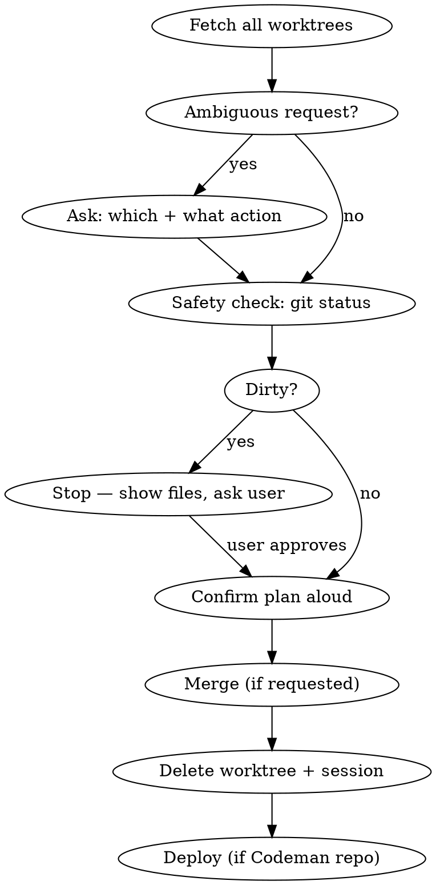

# Codeman Merge & Close Worktree

## Overview

Safely merge and/or close Codeman worktree sessions via API. Base URL: `http://localhost:3001`.

**The #1 rule: uncommitted changes are unrecoverable once a worktree directory is deleted. Always check first.**

## Workflow



## Step 1 — Fetch and clarify

**Always fetch current worktrees first:**
```bash
curl -s http://localhost:3001/api/sessions | jq '[.[] | select(.worktreeBranch) | {id, name, worktreeBranch, worktreeOriginId}]'
```

**If the request is ambiguous in ANY way** (vague names, multiple worktrees, unclear action), show the list and ask:
- Which worktree(s)?
- What action for each: **merge+close**, **merge only**, or **delete only** (no merge — destructive)?

**Never assume.** "Close the Codeman worktree" with three Codeman worktrees requires clarification.

## Step 2 — Safety check BEFORE any deletion

For every worktree you will remove:

```bash
git -C /path/to/worktree status --short
```

**If output is non-empty → STOP.**

Show the user the changed/untracked files and ask:
- Commit them first?
- Or discard them?

**NEVER use `force: true` or `--force` unless the user explicitly confirms they want to discard the changes.**

## Step 3 — Confirm plan aloud

Before touching anything, state what you're about to do:

> "Plan: merge+close `fix/foo` (clean), delete-only `fix/bar` (clean). Proceeding."

If anything is still unclear — ask.

## Step 4 — Merge into parent (if merging)

```bash
curl -s -X POST http://localhost:3001/api/sessions/ORIGIN_SESSION_ID/worktree/merge \
  -H "Content-Type: application/json" \
  -d '{"branch": "fix/my-branch"}'
```

Responses:
- `{ success: true }` — done
- `{ success: false, uncommittedChanges: true }` — commit first, then retry
- `{ success: false, error: { code: "OPERATION_FAILED" } }` — git conflict; show message to user

To commit manually before retrying:
```bash
git -C /path/to/worktree add -A && git -C /path/to/worktree commit -m "fix: description"
```

## Step 4b — Update work item (if linked)

Read `TASK.md` from the worktree (at the `worktreePath` returned by Step 4) and extract the `work_item_id` field. If the field is absent or its value is `none`, skip this step entirely.

```bash
curl -s -X PATCH http://localhost:3001/api/work-items/<work_item_id> \
  -H "Content-Type: application/json" \
  -d '{"status": "done"}'
```

Confirm success: check that the response includes `"data": { "status": "done" }`. If the PATCH fails or returns an error, log a warning and proceed — work item tracking must never block the merge.

This PATCH fires the Clockwork OS webhook if one is configured.

## Step 5 — Delete worktree and session

```bash
# Remove worktree from disk
curl -s -X DELETE http://localhost:3001/api/sessions/WORKTREE_SESSION_ID/worktree \
  -H "Content-Type: application/json" \
  -d '{"force": false}'

# Remove session from sidebar
curl -s -X DELETE http://localhost:3001/api/sessions/WORKTREE_SESSION_ID
```

If the session is already gone but the directory remains:
```bash
git -C /home/siggi/sources/Codeman worktree remove /path/to/worktree
# Add --force ONLY if user explicitly approved discarding uncommitted changes
```

## Step 6 — Deploy (Codeman repo only)

```bash
npm run build && cp -r dist /home/siggi/.codeman/app/ && cp package.json /home/siggi/.codeman/app/package.json && systemctl --user restart codeman-web
```

## Common Mistakes

| Mistake | Fix |
|---------|-----|
| Acting without clarifying which worktrees | Always list + confirm first |
| Force-deleting without checking dirty state | `git status --short` first; stop if any output |
| Treating "close" as implying a merge | Ask explicitly: merge+close, merge only, or delete only? |
| Using `force: true` without user approval | Only force if user said "yes, discard the changes" |
| Forgetting to delete the session after the worktree | Always `DELETE /api/sessions/:id` after worktree removal |
| Wrong port | Codeman runs on **3001**, not 3000 |
| Forgetting to mark work item done | After merge, PATCH work item status to 'done' to trigger Clockwork webhook |
