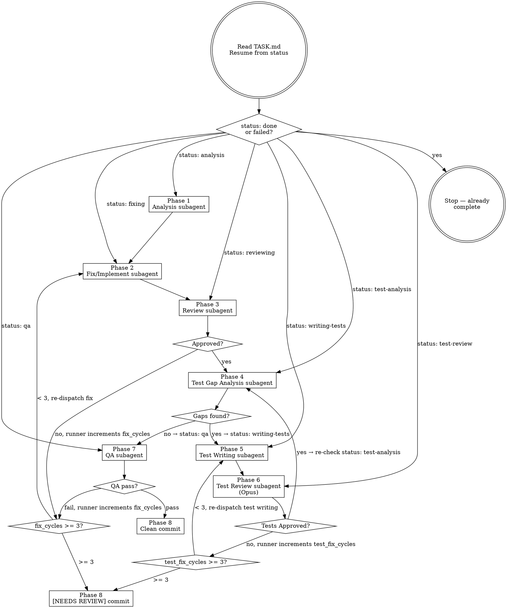

# Codeman Task Runner

## Overview

Run the full autonomous task workflow inside a Codeman worktree session. Reads `TASK.md` in the current directory to determine task type, current phase, and all prior context. Dispatches fresh subagents for each phase. Updates `TASK.md` after every phase so the workflow survives context compaction and session resets.

**First action (always):** Re-read `TASK.md` before doing anything else. Resume from the `status` field. Do not rely on conversation history.

**If `status` is `done` or `failed`:** Output a short message ("Task already completed — status: <status>. See TASK.md for results.") and stop. Do not re-run a completed task.

## Work Item Status Updates

If `work_item_id` is present in TASK.md frontmatter and is not `none`, update the work item status at each phase transition using:

```bash
curl -s -X PATCH http://localhost:3001/api/work-items/<work_item_id> \
  -H "Content-Type: application/json" \
  -d '{"status": "<new_status>"}'
```

If the API returns an error or is unavailable, log a warning and continue. Work item tracking must never block the task workflow.

Phase transition mapping (the runner does these updates, not subagents):

| Transition | Status to set |
|-----------|--------------|
| After Phase 1 (Analysis) completes, before dispatching Phase 2 | `in_progress` |
| After Phase 3 (Review) is APPROVED, before dispatching Phase 4 | `review` |
| After Phase 8 clean commit (status: done) | `done` |
| After Phase 8 NEEDS REVIEW commit (status: failed) | `blocked` |

## Workflow



## Phase 1 — Analysis

Dispatch a fresh subagent with this prompt (substitute TASK.md content):

> "You are the Analysis subagent for an autonomous Codeman task workflow.
>
> **TASK.md content:**
> <paste full TASK.md here>
>
> **Your job:**
> 1. Read the description and explore the codebase to understand the affected area.
> 2. For bugs: attempt to reproduce the issue. Document exact reproduction steps. Identify root cause hypothesis.
>    For features: gather implicit constraints from existing code. Draft a minimal implementation spec.
> 3. Determine `affected_area`: `backend` | `frontend` | `logic`. Use `unknown` only if genuinely ambiguous.
> 4. Update `TASK.md`:
>    - Fill in the `## Reproduction` section with your reproduction steps (bugs only — skip if the section is absent from TASK.md, as feature tasks don't have it).
>    - Fill in the `## Root Cause / Spec` section with your root cause hypothesis (bugs) or implementation spec (features).
>    - Update the `affected_area` field.
>    - Change `status` from `analysis` to `fixing`.
>
> Do not implement anything. Analysis only."

After subagent completes, verify TASK.md `status` is now `fixing` before proceeding.

## Phase 2 — Fix / Implement

Dispatch a fresh subagent with this prompt:

> "You are the Fix subagent for an autonomous Codeman task workflow.
>
> **TASK.md content:**
> <paste full TASK.md here>
>
> **Your job:**
> 1. Read the task description and analysis findings in TASK.md.
> 2. If `## Review History` has rejection entries, read each rejection carefully and address every issue listed before implementing. Do not repeat mistakes from prior attempts.
> 3. Implement the minimal fix or feature. Stay focused — no unrelated cleanup or refactoring.
> 4. Document key decisions in the '## Decisions & Context' section of TASK.md (append, never overwrite).
> 5. Update the '## Fix / Implementation Notes' section with what you changed and why.
> 6. Change `status` from `fixing` to `reviewing`.
>
> Keep changes minimal and focused on what TASK.md describes."

After subagent completes, verify TASK.md `status` is now `reviewing` before proceeding.

## Phase 3 — Review Loop

Dispatch a fresh subagent with this prompt:

> "You are the Review subagent for an autonomous Codeman task workflow.
>
> **TASK.md content:**
> <paste full TASK.md here>
>
> **Git diff:**
> <paste output of `git diff HEAD` here>
>
> **Your job:**
> 1. Review the changes against the task description. Be a strict but fair code reviewer.
> 2. Check: correctness, edge cases, TypeScript strictness (no implicit any, unused vars), security, consistency with existing patterns.
> 3. Give your verdict:
>    - **APPROVED** — changes look good, ready for test gap analysis
>    - **REJECTED** — list specific, actionable issues (no vague feedback)
> 4. Append your review to the '## Review History' section of TASK.md in this format:
>    ### Review attempt <N> — <APPROVED|REJECTED>
>    <your findings>
> 5. If APPROVED: change `status` to `test-analysis`.
>    If REJECTED: leave `status` as `reviewing`.
>
> IMPORTANT: Do NOT modify the `fix_cycles` or `test_fix_cycles` fields — the runner does that.
> Do not modify any source files. Review only."

After subagent completes, read TASK.md `status`:
- `test-analysis` → proceed to Phase 4
- `reviewing` → **runner** increments `fix_cycles` in TASK.md, then checks limit:
  - `fix_cycles < 3` → re-dispatch Phase 2 (Fix)
  - `fix_cycles >= 3` → proceed to Phase 8 `[NEEDS REVIEW]` path

## Phase 4 — Test Gap Analysis

**Before dispatching:** If `test_fix_cycles` is absent from TASK.md, add `test_fix_cycles: 0` to the header fields now (runner does this, not subagent).

Dispatch a fresh subagent with this prompt:

> "You are the Test Gap Analysis subagent for an autonomous Codeman task workflow.
>
> **TASK.md content:**
> <paste full TASK.md here>
>
> **Changed files:**
> <paste output of `git diff HEAD --name-only` here>
>
> **Your job:**
> 1. Identify all source files changed by this task (exclude TASK.md, CLAUDE.md, docs).
> 2. For each changed source file, check whether a corresponding test file exists in the `test/` directory and whether the new/changed code has meaningful test coverage.
>    - Look at existing test patterns: `ls test/` and read a few test files to understand the project's testing style.
>    - A gap exists when: new functions/methods have no tests, new API endpoints lack route tests, new UI behaviour has no Playwright assertions, or new logic branches are untested.
> 3. Give your verdict:
>    - **GAPS FOUND** — list each gap concisely (file, what's missing)
>    - **NO GAPS** — all changed code is adequately covered
> 4. Update TASK.md:
>    - Fill in (or replace) the `## Test Gap Analysis` section with your findings.
>    - If GAPS FOUND: change `status` to `writing-tests`.
>    - If NO GAPS: change `status` to `qa`.
>
> IMPORTANT: Do NOT write any tests. Analysis only. Do NOT modify source files."

After subagent completes, read TASK.md `status`:
- `writing-tests` → proceed to Phase 5
- `qa` → proceed to Phase 7

## Phase 5 — Test Writing

Dispatch a fresh subagent with this prompt:

> "You are the Test Writing subagent for an autonomous Codeman task workflow.
>
> **TASK.md content:**
> <paste full TASK.md here>
>
> **Your job:**
> 1. Read the `## Test Gap Analysis` section of TASK.md to understand exactly what tests are needed.
> 2. Read several existing test files in the `test/` directory to understand the project's testing patterns, naming conventions, and assertion style. Match them exactly.
> 3. Write tests that fill each identified gap. Follow the project's test patterns. Do not over-engineer — one well-named test per behaviour is enough.
> 4. Run the tests to verify they pass: `npx vitest run test/<relevant-file>.test.ts`
>    If tests fail due to implementation bugs (not test bugs), document the failure in TASK.md `## Test Writing Notes` and still proceed — the test review will catch it.
> 5. Update TASK.md:
>    - Fill in the `## Test Writing Notes` section: list each test file created/modified and what each test covers.
>    - Change `status` from `writing-tests` to `test-review`.
>
> Keep tests focused on the gaps identified. Do not refactor existing tests."

After subagent completes, verify TASK.md `status` is now `test-review` before proceeding.

## Phase 6 — Test Review Loop (Opus)

**Use the Opus model for this subagent.** Pass `model: "opus"` when dispatching.

Dispatch a fresh **Opus** subagent with this prompt:

> "You are the Test Review subagent for an autonomous Codeman task workflow. You are reviewing newly written tests with a critical eye.
>
> **TASK.md content:**
> <paste full TASK.md here>
>
> **Git diff (tests only):**
> <paste output of `git diff HEAD -- test/` here>
>
> **Your job:**
> 1. Review the newly written tests against the gaps listed in `## Test Gap Analysis`.
> 2. Check each test for:
>    - **Coverage**: does it actually test the gap it claims to address?
>    - **Correctness**: does the assertion verify real behaviour, not just that the code runs?
>    - **Realism**: are the test inputs/mocks realistic? Do they reflect production scenarios?
>    - **Edge cases**: are important boundaries tested (empty input, error paths, off-by-one)?
>    - **Style**: do the tests match the project's existing test patterns and naming conventions?
> 3. Give your verdict:
>    - **APPROVED** — tests are solid and all gaps are covered
>    - **REJECTED** — list specific, actionable issues for each failing test (no vague feedback)
> 4. Append your review to the `## Test Review History` section of TASK.md in this format:
>    ### Test review attempt <N> — <APPROVED|REJECTED>
>    <your findings>
> 5. If APPROVED: change `status` to `test-analysis` (triggers a re-check for any remaining gaps).
>    If REJECTED: leave `status` as `test-review`.
>
> IMPORTANT: Do NOT modify the `fix_cycles` or `test_fix_cycles` fields — the runner does that.
> Do not modify any source files or test files. Review only."

After subagent completes, read TASK.md `status`:
- `test-analysis` → proceed to Phase 4 (re-check for remaining gaps — if none found this time, moves to QA)
- `test-review` → **runner** increments `test_fix_cycles` in TASK.md, then checks limit:
  - `test_fix_cycles < 3` → re-dispatch Phase 5 (Test Writing), passing the latest rejection notes
  - `test_fix_cycles >= 3` → proceed to Phase 8 `[NEEDS REVIEW]` path

## Phase 7 — QA

Dispatch a fresh subagent with this prompt:

> "You are the QA subagent for an autonomous Codeman task workflow.
>
> **TASK.md content:**
> <paste full TASK.md here>
>
> **Your job:**
> Run quality checks on the current implementation and report results.
>
> **Always run:**
> 1. `tsc --noEmit` — TypeScript typecheck. Must pass with zero errors.
> 2. `npm run lint` — ESLint. Must pass.
> 3. If any test files exist in `test/` that are relevant to this task, run them:
>    `npx vitest run test/<relevant-file>.test.ts`
>    All tests must pass.
>
> **Targeted check based on `affected_area`:**
>
> First, determine the QA port:
> 1. Read TASK.md and look for `assignedPort` in the frontmatter or a line matching `Assigned dev port for this worktree: <N>` in the worktreeNotes / description.
> 2. If found, use that port. If not found, find a free port by running: `node -e "const s=require('net').createServer();s.listen(0,'0.0.0.0',()=>{console.log(s.address().port);s.close()})"` and use the output.
> 3. Store the chosen port in a variable (e.g., `QA_PORT`) and use it in all commands below.
>
> - `backend` → start the dev server in the background, curl the affected endpoint, verify the response matches expected behaviour, kill the server.
>   Start command: `nohup npx tsx src/index.ts web --port $QA_PORT > /tmp/codeman-$QA_PORT.log 2>&1 &`
>   Then wait and verify: `sleep 6 && curl -s http://localhost:$QA_PORT/api/status`
>   **IMPORTANT: there is no `--host` flag** — the server always binds to `0.0.0.0` automatically. Never pass `--host`.
>   Kill when done: `pkill -f "tsx src/index.ts web --port $QA_PORT"`
> - `frontend` → start the dev server the same way (using $QA_PORT). **If the server fails to start, this is a QA FAILURE — do not skip.** Read `/tmp/codeman-$QA_PORT.log`, report the error. Then use Playwright to:
>   1. Load the page with `waitUntil: 'domcontentloaded'`, wait 3–4 seconds for async data.
>   2. **Verify CSS rules are active:** For each CSS rule changed in the diff, use `document.querySelector` to find a matching element and `window.getComputedStyle()` to verify the changed property has the expected value (not browser defaults like `maxWidth: "none"`). If computed styles don't match the CSS source, a CSS parse error is likely swallowing rules — investigate and fix.
>   3. Assert the UI change is visible and correct.
>   4. Kill server when done.
> - `logic` → run the relevant vitest test file: `npx vitest run test/<file>.test.ts`
> - `unknown` → run only typecheck + lint (no targeted check).
>
> **After all checks:**
> Update the '## QA Results' section of TASK.md with pass/fail status for each check run and any error output.
> - All pass → change `status` to `done`
> - Any fail → change `status` back to `fixing`
>
> **Docs Staleness Check (always run, informational only):**
> Run:
> ```bash
> git diff master..HEAD --name-only
> ```
> Apply these rules to the output:
> - Any file matching `src/web/routes/*.ts` → flag: `"API docs may need update (src/web/routes/ changed)"`
> - Any file matching `src/web/public/app.js` or `src/web/public/styles.css` → flag: `"UI docs may need update (frontend changed significantly)"`
> - Any file matching `skills/*/SKILL.md` → flag: `"Skill docs may need update (skills/ changed)"`
>
> Output the flags in `## QA Results` under a `### Docs Staleness` subsection. If no flags apply, output `### Docs Staleness: none`. Do NOT update any docs — this is advisory only.
>
> IMPORTANT: Do NOT modify the `fix_cycles` or `test_fix_cycles` fields — the runner does that."

After subagent completes, read TASK.md `status`:
- `done` → proceed to Phase 8 (clean commit path)
- `fixing` → **runner** increments `fix_cycles`, then checks limit:
  - `fix_cycles < 3` → re-dispatch Phase 2 (Fix)
  - `fix_cycles >= 3` → proceed to Phase 8 `[NEEDS REVIEW]` path

## Phase 8 — Commit & Report

**Clean path (QA passed, status: done):**

```bash
git add -A
git commit -m "fix(<affected_area>): <title>"
# or for features:
git commit -m "feat(<affected_area>): <title>"
```

Output to terminal:
```
✓ Task complete.
Branch: <branch-name>
Commit: <hash>
Summary: <one paragraph from Fix/Implementation Notes>
```

**Auto-start dev server (both paths):**

After the commit, extract `assignedPort` from TASK.md's `worktreeNotes` section — look for a line matching `Assigned dev port for this worktree: <N>` or `Port: <N>`. If found:

```bash
nohup npx tsx src/index.ts web --port <assignedPort> > /tmp/codeman-<assignedPort>.log 2>&1 &
sleep 6 && curl -s http://localhost:<assignedPort>/api/status
```

- If the curl returns a JSON response, print: `Dev server started at http://localhost:<assignedPort>`
- If the curl fails or times out, print: `WARNING: Dev server may not have started — check /tmp/codeman-<assignedPort>.log`
- If `assignedPort` is not found in TASK.md, skip auto-start (the Phase 9 output will include the manual start command instead).

Then output **user testing instructions** (see Phase 9 below).

**`[NEEDS REVIEW]` path (fix_cycles >= 3 or test_fix_cycles >= 3):**

```bash
# Write commit message to temp file
cat > /tmp/task-commit-msg.txt << 'ENDOFMSG'
[NEEDS REVIEW]: fix(<affected_area>): <title>

Review history:
<paste Review History section from TASK.md>

Test review history:
<paste Test Review History section from TASK.md, if present>

QA results:
<paste QA Results section from TASK.md>
ENDOFMSG

git add -A
git commit -F /tmp/task-commit-msg.txt
rm /tmp/task-commit-msg.txt
```

Update TASK.md `status` → `failed`.

Output to terminal:
```
⚠ NEEDS HUMAN REVIEW — fix_cycles limit reached.
Branch: <branch-name>
Commit: <hash> (committed with warnings)
See TASK.md Review History for details.
```

Then run the **Auto-start dev server** step above (same logic applies on the NEEDS REVIEW path).

Then output **user testing instructions** (see Phase 9 below) — even on the NEEDS REVIEW path, the user should know how to verify what was built.

## Phase 9 — User Testing Instructions

After every commit (clean or NEEDS REVIEW), output a human-readable testing guide so the user can manually verify the feature. This is always the final output of the workflow.

**Format:**

```
━━━━━━━━━━━━━━━━━━━━━━━━━━━━━━━━━━━━━
🧪 HOW TO TEST: <title>
━━━━━━━━━━━━━━━━━━━━━━━━━━━━━━━━━━━━━

Dev server (started automatically — verify with):
  curl -s http://localhost:<assignedPort>/api/status | jq .status

[If assignedPort was unknown and server was NOT auto-started, use:]
  nohup npx tsx src/index.ts web --port <assignedPort> > /tmp/codeman-<assignedPort>.log 2>&1 &
  sleep 6 && curl -s http://localhost:<assignedPort>/api/status | jq .status

Steps to test:
  1. <concrete action the user takes, e.g. "Open http://localhost:<port> in your browser">
  2. <next action, e.g. "Click the session tab for 'feat/my-feature'">
  3. <what to verify, e.g. "Confirm the session indicator bar appears above the MCP bar showing the session name and project folder">
  4. <edge case or negative test, e.g. "Switch to a different session — confirm the bar updates">
  ... (as many steps as needed)

Expected result:
  <one or two sentences describing what success looks like>

To merge when satisfied:
  Use the Codeman UI merge button, or ask: "merge the worktree for feat/<branch>"
━━━━━━━━━━━━━━━━━━━━━━━━━━━━━━━━━━━━━
```

**Rules for writing the steps:**
- Steps must be concrete and actionable — "open X", "click Y", "swipe left", "press Ctrl+F"
- Cover the happy path AND at least one edge case or negative test
- If the feature is frontend: include the URL to open and what element to look for
- If the feature is backend: include the `curl` command to run and what response to expect
- If the feature involves mobile: note to test on a narrow viewport or mobile device
- Use the `assignedPort` extracted from TASK.md's `worktreeNotes` (`Assigned dev port for this worktree: <N>`). The server was auto-started in Phase 8 if the port was found. If unknown, default to `3099` and include the full nohup start command.
- Keep it brief — a user should be able to read this in 30 seconds and know exactly what to do

## TASK.md Fields Reference

The runner manages these fields in TASK.md. When starting a new task, ensure both are present — add them if missing:

```
fix_cycles: 0
test_fix_cycles: 0
```

`fix_cycles` counts code review + QA failures. `test_fix_cycles` counts test review failures. They are independent counters. The runner increments them; subagents never touch them.

## Context Safety Rule

If you detect that context has been lost (e.g., after `/compact` or `/clear`):
1. Re-read `TASK.md` from disk
2. Resume from the `status` field
3. Never start from scratch — always trust TASK.md over conversation history

The `CLAUDE.md` in this directory will have already triggered this rule before you read it. This is intentional.

---

## Common Mistakes

| Mistake | Fix |
|---------|-----|
| Relying on conversation history after compact | Always re-read TASK.md first |
| Dispatching subagents without pasting TASK.md | Each subagent gets full TASK.md content — no shared context |
| Incrementing fix_cycles or test_fix_cycles inside a subagent | The runner (not subagents) increments these — subagent prompts say so explicitly |
| Starting from scratch after a restart | Check TASK.md status — resume from current phase |
| Re-running a completed task | If status is `done` or `failed`, output a message and stop |
| Skipping TASK.md update after a phase | Update TASK.md before dispatching next subagent — it's the only persistent state |
| Using default model for test review | Phase 6 test review MUST use Opus (`model: "opus"`) — it's the quality gate for tests |
| Re-dispatching test writing without the rejection notes | Pass the latest `## Test Review History` rejection clearly in the prompt |
| Skipping test gap re-check after test review approval | After Opus approves tests, always re-run Phase 4 — there may be additional gaps |
| Sending input to a session without `useMux: true` | `POST /api/sessions/:id/input` without `"useMux": true` writes text but never sends Enter — Claude never receives it. Always include `"useMux": true` |
