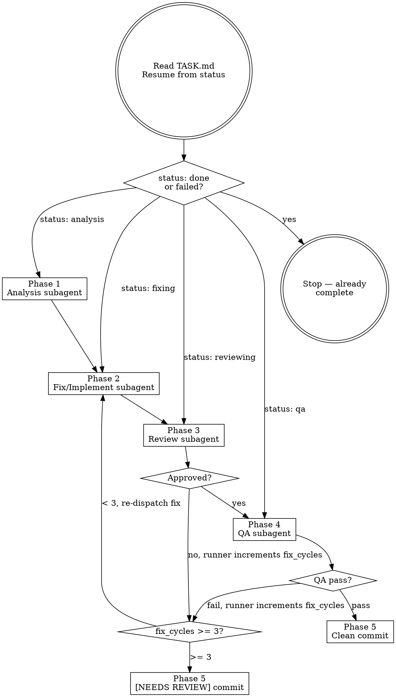

# Codeman Task Runner

## Overview

Run the full autonomous task workflow inside a Codeman worktree session. Reads `TASK.md` in the current directory to determine task type, current phase, and all prior context. Dispatches fresh subagents for each phase. Updates `TASK.md` after every phase so the workflow survives context compaction and session resets.

**First action (always):** Re-read `TASK.md` before doing anything else. Resume from the `status` field. Do not rely on conversation history.

**If `status` is `done` or `failed`:** Output a short message ("Task already completed — status: <status>. See TASK.md for results.") and stop. Do not re-run a completed task.

## Workflow



## Phase 1 — Analysis

Dispatch a fresh subagent with this prompt (substitute TASK.md content):

> "You are the Analysis subagent for an autonomous Codeman task workflow.
>
> **TASK.md content:**
> <paste full TASK.md here>
>
> **Your job:**
> 1. Read the description and explore the codebase to understand the affected area.
> 2. For bugs: attempt to reproduce the issue. Document exact reproduction steps. Identify root cause hypothesis.
>    For features: gather implicit constraints from existing code. Draft a minimal implementation spec.
> 3. Determine `affected_area`: `backend` | `frontend` | `logic`. Use `unknown` only if genuinely ambiguous.
> 4. Update `TASK.md`:
>    - Fill in the `## Reproduction` section with your reproduction steps (bugs only — skip if the section is absent from TASK.md, as feature tasks don't have it).
>    - Fill in the `## Root Cause / Spec` section with your root cause hypothesis (bugs) or implementation spec (features).
>    - Update the `affected_area` field.
>    - Change `status` from `analysis` to `fixing`.
>
> Do not implement anything. Analysis only."

After subagent completes, verify TASK.md `status` is now `fixing` before proceeding.

## Phase 2 — Fix / Implement

Dispatch a fresh subagent with this prompt:

> "You are the Fix subagent for an autonomous Codeman task workflow.
>
> **TASK.md content:**
> <paste full TASK.md here>
>
> **Your job:**
> 1. Read the task description and analysis findings in TASK.md.
> 2. If `## Review History` has rejection entries, read each rejection carefully and address every issue listed before implementing. Do not repeat mistakes from prior attempts.
> 3. Implement the minimal fix or feature. Stay focused — no unrelated cleanup or refactoring.
> 4. Document key decisions in the '## Decisions & Context' section of TASK.md (append, never overwrite).
> 5. Update the '## Fix / Implementation Notes' section with what you changed and why.
> 6. Change `status` from `fixing` to `reviewing`.
>
> Keep changes minimal and focused on what TASK.md describes."

After subagent completes, verify TASK.md `status` is now `reviewing` before proceeding.

## Phase 3 — Review Loop

Dispatch a fresh subagent with this prompt:

> "You are the Review subagent for an autonomous Codeman task workflow.
>
> **TASK.md content:**
> <paste full TASK.md here>
>
> **Git diff:**
> <paste output of `git diff HEAD` here>
>
> **Your job:**
> 1. Review the changes against the task description. Be a strict but fair code reviewer.
> 2. Check: correctness, edge cases, TypeScript strictness (no implicit any, unused vars), security, consistency with existing patterns.
> 3. Give your verdict:
>    - **APPROVED** — changes look good, ready for QA
>    - **REJECTED** — list specific, actionable issues (no vague feedback)
> 4. Append your review to the '## Review History' section of TASK.md in this format:
>    ### Review attempt <N> — <APPROVED|REJECTED>
>    <your findings>
> 5. If APPROVED: change `status` to `qa`.
>    If REJECTED: leave `status` as `reviewing`.
>
> IMPORTANT: Do NOT modify the `fix_cycles` field — the runner does that.
> Do not modify any source files. Review only."

After subagent completes, read TASK.md `status`:
- `qa` → proceed to Phase 4
- `reviewing` → **runner** increments `fix_cycles` in TASK.md, then checks limit:
  - `fix_cycles < 3` → re-dispatch Phase 2 (Fix)
  - `fix_cycles >= 3` → proceed to Phase 5 `[NEEDS REVIEW]` path

## Phase 4 — QA

Dispatch a fresh subagent with this prompt:

> "You are the QA subagent for an autonomous Codeman task workflow.
>
> **TASK.md content:**
> <paste full TASK.md here>
>
> **Your job:**
> Run quality checks on the current implementation and report results.
>
> **Always run:**
> 1. `tsc --noEmit` — TypeScript typecheck. Must pass with zero errors.
> 2. `npm run lint` — ESLint. Must pass.
>
> **Targeted check based on `affected_area`:**
> - `backend` → start the dev server in the background, curl the affected endpoint, verify the response matches expected behaviour, kill the server.
>   Start command: `nohup npx tsx src/index.ts web --port 3099 > /tmp/codeman-3099.log 2>&1 &`
>   Then wait and verify: `sleep 6 && curl -s http://localhost:3099/api/status`
>   **IMPORTANT: there is no `--host` flag** — the server always binds to `0.0.0.0` automatically. Never pass `--host`.
>   Kill when done: `pkill -f "tsx src/index.ts web --port 3099"`
> - `frontend` → start the dev server the same way (port 3099), use Playwright to load the page with `waitUntil: 'domcontentloaded'`, wait 3–4 seconds for async data, assert the UI change is visible and correct. Kill server when done.
> - `logic` → run the relevant vitest test file: `npx vitest run test/<file>.test.ts`
> - `unknown` → run only typecheck + lint (no targeted check).
>
> **After all checks:**
> Update the '## QA Results' section of TASK.md with pass/fail status for each check run and any error output.
> - All pass → change `status` to `done`
> - Any fail → change `status` back to `fixing`
>
> IMPORTANT: Do NOT modify the `fix_cycles` field — the runner does that."

After subagent completes, read TASK.md `status`:
- `done` → proceed to Phase 5 (clean commit path)
- `fixing` → **runner** increments `fix_cycles`, then checks limit:
  - `fix_cycles < 3` → re-dispatch Phase 2 (Fix)
  - `fix_cycles >= 3` → proceed to Phase 5 `[NEEDS REVIEW]` path

## Phase 5 — Commit & Report

**Clean path (QA passed, status: done):**

```bash
git add -A
git commit -m "fix(<affected_area>): <title>"
# or for features:
git commit -m "feat(<affected_area>): <title>"
```

Output to terminal:
```
✓ Task complete.
Branch: <branch-name>
Commit: <hash>
Summary: <one paragraph from Fix/Implementation Notes>
```

Then output **user testing instructions** (see Phase 6 below).

**`[NEEDS REVIEW]` path (fix_cycles >= 3):**

```bash
# Write commit message to temp file
cat > /tmp/task-commit-msg.txt << 'ENDOFMSG'
[NEEDS REVIEW]: fix(<affected_area>): <title>

Review history:
<paste Review History section from TASK.md>

QA results:
<paste QA Results section from TASK.md>
ENDOFMSG

git add -A
git commit -F /tmp/task-commit-msg.txt
rm /tmp/task-commit-msg.txt
```

Update TASK.md `status` → `failed`.

Output to terminal:
```
⚠ NEEDS HUMAN REVIEW — fix_cycles limit reached.
Branch: <branch-name>
Commit: <hash> (committed with warnings)
See TASK.md Review History for details.
```

Then output **user testing instructions** (see Phase 6 below) — even on the NEEDS REVIEW path, the user should know how to verify what was built.

## Phase 6 — User Testing Instructions

After every commit (clean or NEEDS REVIEW), output a human-readable testing guide so the user can manually verify the feature. This is always the final output of the workflow.

**Format:**

```
━━━━━━━━━━━━━━━━━━━━━━━━━━━━━━━━━━━━━
🧪 HOW TO TEST: <title>
━━━━━━━━━━━━━━━━━━━━━━━━━━━━━━━━━━━━━

Dev server (if not already running):
  nohup npx tsx src/index.ts web --port <assignedPort> > /tmp/codeman-<assignedPort>.log 2>&1 &
  sleep 6 && curl -s http://localhost:<assignedPort>/api/status | jq .status

Steps to test:
  1. <concrete action the user takes, e.g. "Open http://localhost:<port> in your browser">
  2. <next action, e.g. "Click the session tab for 'feat/my-feature'">
  3. <what to verify, e.g. "Confirm the session indicator bar appears above the MCP bar showing the session name and project folder">
  4. <edge case or negative test, e.g. "Switch to a different session — confirm the bar updates">
  ... (as many steps as needed)

Expected result:
  <one or two sentences describing what success looks like>

To merge when satisfied:
  Use the Codeman UI merge button, or ask: "merge the worktree for feat/<branch>"
━━━━━━━━━━━━━━━━━━━━━━━━━━━━━━━━━━━━━
```

**Rules for writing the steps:**
- Steps must be concrete and actionable — "open X", "click Y", "swipe left", "press Ctrl+F"
- Cover the happy path AND at least one edge case or negative test
- If the feature is frontend: include the URL to open and what element to look for
- If the feature is backend: include the `curl` command to run and what response to expect
- If the feature involves mobile: note to test on a narrow viewport or mobile device
- Use the `assignedPort` from the worktree session's `worktreeNotes` (visible in TASK.md or the session's notes) — default to `3099` if unknown
- Keep it brief — a user should be able to read this in 30 seconds and know exactly what to do

## Context Safety Rule

If you detect that context has been lost (e.g., after `/compact` or `/clear`):
1. Re-read `TASK.md` from disk
2. Resume from the `status` field
3. Never start from scratch — always trust TASK.md over conversation history

The `CLAUDE.md` in this directory will have already triggered this rule before you read it. This is intentional.

---

## Common Mistakes

| Mistake | Fix |
|---------|-----|
| Relying on conversation history after compact | Always re-read TASK.md first |
| Dispatching subagents without pasting TASK.md | Each subagent gets full TASK.md content — no shared context |
| Incrementing fix_cycles inside a subagent | The runner (not subagents) increments fix_cycles — subagent prompts say so explicitly |
| Starting from scratch after a restart | Check TASK.md status — resume from current phase |
| Re-running a completed task | If status is `done` or `failed`, output a message and stop |
| Skipping TASK.md update after a phase | Update TASK.md before dispatching next subagent — it's the only persistent state |
| Sending input to a session without `useMux: true` | `POST /api/sessions/:id/input` without `"useMux": true` writes text but never sends Enter — Claude never receives it. Always include `"useMux": true` |
