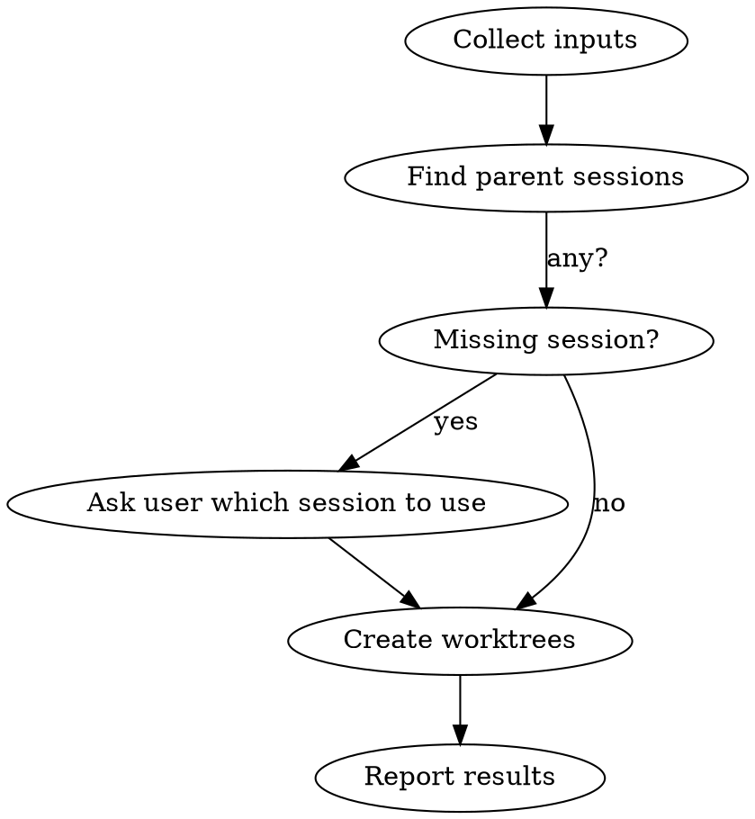

# Codeman Worktree Creator

## Overview

Create git worktrees + Codeman sessions via API. Handles multiple repos in one conversation. Base URL: `http://localhost:3001`.

## Workflow



## Step 1 — Collect Inputs

Ask the user (in one message) for everything missing:
- Which **project(s)** (repo name or path)
- **Branch name(s)** for each (e.g. `feat/my-feature`)
- **Description/notes** for each worktree — bug details, task context, etc. (pass as `notes`)
- New branch or existing? (default: new)

If user already provided these, skip asking.

## Step 2 — Find Parent Session

```bash
curl -s http://localhost:3001/api/sessions
```

Returns array of session objects. Find the best match for each project:
- Filter: `worktreeBranch` is null/absent (main sessions only, not sub-worktrees)
- Match: `workingDir` contains the project name (case-insensitive)
- Prefer: `status: idle` over `busy`; shorter `workingDir` (closer to repo root)

If multiple candidates, pick the most likely one. If none found, ask the user which session ID to use.

## Step 3 — Create Worktree

For each project × branch pair:

```bash
curl -s -X POST http://localhost:3001/api/sessions/SESSION_ID/worktree \
  -H "Content-Type: application/json" \
  -d '{"branch": "feat/my-feature", "isNew": true, "notes": "Bug: hamburger menu blocked by overlay"}'
```

**Body fields:**
| Field | Type | Required | Notes |
|-------|------|----------|-------|
| `branch` | string | yes | Full branch name e.g. `feat/my-feature` |
| `isNew` | boolean | yes | `true` = create new branch, `false` = checkout existing |
| `mode` | string | no | `claude` / `opencode` / `shell` — inherits from parent if omitted |
| `notes` | string | no | Bug description or task context (max 2000 chars) — stored on the session |

**Success response:** `{ success: true, session: {...}, worktreePath: "/path/to/worktree" }`

**Error response:** `{ success: false, error: { code, message } }`

Common errors:
- `OPERATION_FAILED` + "branch already exists" → set `isNew: false`
- `NOT_FOUND` → wrong session ID, re-fetch sessions
- `INVALID_INPUT` → branch name invalid (no spaces, valid git ref)

## Step 4 — Multiple Repos in Parallel

When creating worktrees across multiple repos, run all `curl` calls in a single Bash command with `&` and `wait`, or sequentially if you need error handling per repo.

## Step 5 — Report Results

After all calls complete, summarize:
- ✓ Created: branch name, worktree path, new session name
- ✗ Failed: error message + what to try next

## Common Mistakes

| Mistake | Fix |
|---------|-----|
| Using a worktree session as parent | Find sessions where `worktreeBranch` is null |
| Branch name with spaces | Use hyphens/slashes only |
| `isNew: true` on existing branch | Set `isNew: false` |
| Wrong port | Codeman runs on port **3001**, not 3000 |
