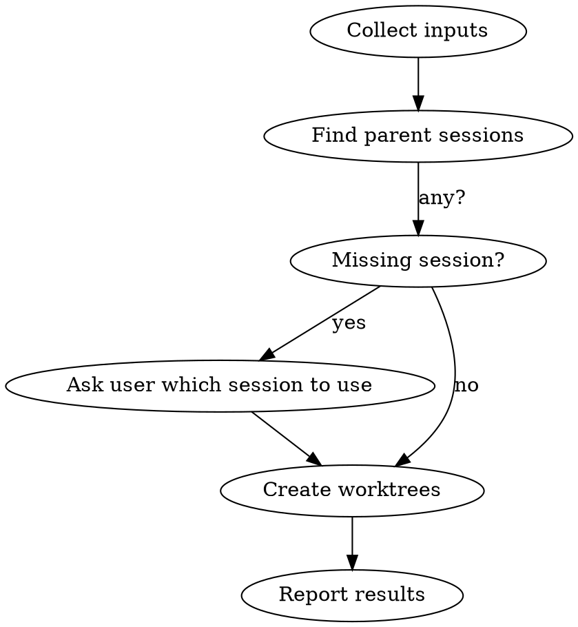

# Codeman Worktree Creator

## Overview

Create git worktrees + Codeman sessions via API. Handles multiple repos in one conversation. Base URL: `http://localhost:3001`.

## Workflow



## Step 1 — Collect Inputs

Ask the user (in one message) for everything missing:
- Which **project(s)** (repo name or path)
- **Branch name(s)** for each (e.g. `feat/my-feature`)
- **Task description** for each worktree — bug details, feature spec, task context
- New branch or existing? (default: new)

If user already provided these, skip asking.

## Step 2 — Find Parent Session

```bash
curl -s http://localhost:3001/api/sessions
```

Returns array of session objects. Find the best match for each project:
- Filter: `worktreeBranch` is null/absent (main sessions only, not sub-worktrees)
- Match: `workingDir` contains the project name (case-insensitive)
- Prefer: `status: idle` over `busy`; shorter `workingDir` (closer to repo root)

If multiple candidates, pick the most likely one. If none found, ask the user which session ID to use.

## Step 3 — Sync Repo to Origin Master

For each repo, before creating the worktree, ensure the local master (or main) branch is up to date with origin. Run from the repo's working directory:

```bash
git -C "<workingDir>" fetch origin
git -C "<workingDir>" merge --ff-only origin/master 2>/dev/null || \
  git -C "<workingDir>" merge --ff-only origin/main 2>/dev/null || \
  echo "SYNC_SKIPPED"
```

- `Already up to date` → fine, continue
- Fast-forward succeeds → continue
- `SYNC_SKIPPED` (no origin/master or origin/main) → skip silently, continue
- `fatal: Not possible to fast-forward` → **stop and report:** "Local master has commits not in origin — manual rebase required before creating this worktree."

Do not create the worktree if fast-forward fails. This ensures the new branch always starts from the latest upstream commit.

## Step 4 — Create Worktree

Pass `taskMd` and `claudeMd` inline so the server writes them atomically before returning. This eliminates the race condition where Claude starts before TASK.md exists.

For each project × branch pair:

```bash
curl -s -X POST http://localhost:3001/api/sessions/SESSION_ID/worktree \
  -H "Content-Type: application/json" \
  -d '{
    "branch": "feat/my-feature",
    "isNew": true,
    "notes": "Read TASK.md in this directory, then invoke the codeman-task-runner skill.",
    "autoStart": false,
    "taskMd": "<TASK.md content as JSON string — see Step 4a>",
    "claudeMd": "<CLAUDE.md content as JSON string — see Step 4b>"
  }'
```

**Body fields:**
| Field | Type | Required | Notes |
|-------|------|----------|-------|
| `branch` | string | yes | Full branch name e.g. `feat/my-feature` |
| `isNew` | boolean | yes | `true` = create new branch, `false` = checkout existing |
| `mode` | string | no | `claude` / `opencode` / `shell` — inherits from parent if omitted |
| `notes` | string | no | Short trigger sentence — stored on session, sent as initial prompt |
| `autoStart` | boolean | no | **Always `false`** — use `/interactive` after creation to avoid race conditions |
| `taskMd` | string | no | Full TASK.md content — server writes this atomically before returning |
| `claudeMd` | string | no | Full CLAUDE.md content — server writes this atomically before returning |

**Do NOT write TASK.md or CLAUDE.md separately** — always use the `taskMd`/`claudeMd` fields so files exist before Claude starts.

**Success response:** `{ success: true, session: {...}, worktreePath: "/path/to/worktree" }`

**Error response:** `{ success: false, error: { code, message } }`

Common errors:
- `OPERATION_FAILED` + "branch already exists" → set `isNew: false`
- `NOT_FOUND` → wrong session ID, re-fetch sessions
- `INVALID_INPUT` → branch name invalid (no spaces, valid git ref)

### Step 4a — TASK.md content

Build the TASK.md from the user's task description. JSON-escape newlines as `\n`:

```markdown
# Task

type: <bug|feature>
status: analysis
title: <title from user>
description: <full description from user>
affected_area: unknown
fix_cycles: 0
test_fix_cycles: 0

## Reproduction
<!-- filled by analysis phase -->

## Root Cause / Spec
<!-- filled by analysis phase -->

## Fix / Implementation Notes
<!-- filled by fix phase -->

## Review History
<!-- appended by each review — never overwrite -->

## Test Gap Analysis
<!-- filled by test gap analysis -->

## QA Results
<!-- filled by QA phase -->

## Decisions & Context
<!-- append-only log of key decisions -->
```

If the project has its own TASK.md template (e.g. in `.skills/`), use that instead.

### Step 4b — CLAUDE.md content

Always pass the generic worktree CLAUDE.md as `claudeMd`. The server will **only write it if no CLAUDE.md already exists** in the worktree — projects that have their own CLAUDE.md in the repo (inherited via git) are preserved automatically.

Generic default:
```markdown
You are working autonomously in a Codeman worktree.
Before doing ANYTHING else, re-read `TASK.md` in this directory
and resume from the phase in `status`.
Do not rely on conversation history.
Then invoke the codeman-task-runner skill.
```

## Step 5 — Start Sessions

After each worktree is created, start Claude:

```bash
curl -s -X POST http://localhost:3001/api/sessions/NEW_SESSION_ID/interactive
```

Use the session ID from the Step 4 response (`session.id`). **Never use `autoStart: true`** — it races against file writes.

## Step 6 — Multiple Repos in Parallel

When creating worktrees across multiple repos, run all sync + curl operations sequentially per repo (sync must complete before the worktree is created for that repo).

## Step 7 — Report Results

After all calls complete, summarize:
- ✓ Created: branch name, worktree path, new session name, session started
- ✗ Failed: error message + what to try next

To merge or close worktrees, use the **codeman-merge-worktree** skill.

---

## Common Mistakes

| Mistake | Fix |
|---------|-----|
| Writing TASK.md/CLAUDE.md separately with Write tool | **Always use `taskMd`/`claudeMd` fields** in the worktree creation request — the server writes them atomically before returning, eliminating race conditions |
| Using `autoStart: true` | **Always use `autoStart: false`**, then call `/interactive` after creation returns — `autoStart` races against file writes |
| Sending input without `\r` | When using `/api/sessions/:id/input`, always append `\r` and include `"useMux": true"` — without `\r` text is typed but never submitted |
| Using a worktree session as parent | Find sessions where `worktreeBranch` is null |
| Branch name with spaces | Use hyphens/slashes only |
| `isNew: true` on existing branch | Set `isNew: false` |
| Wrong port | Codeman runs on port **3001**, not 3000 |
| Skipping the sync step | Always sync before creating — branching from stale master means missing upstream commits |
| Creating worktree when fast-forward fails | Stop and tell the user — do not force-create on a diverged master |
