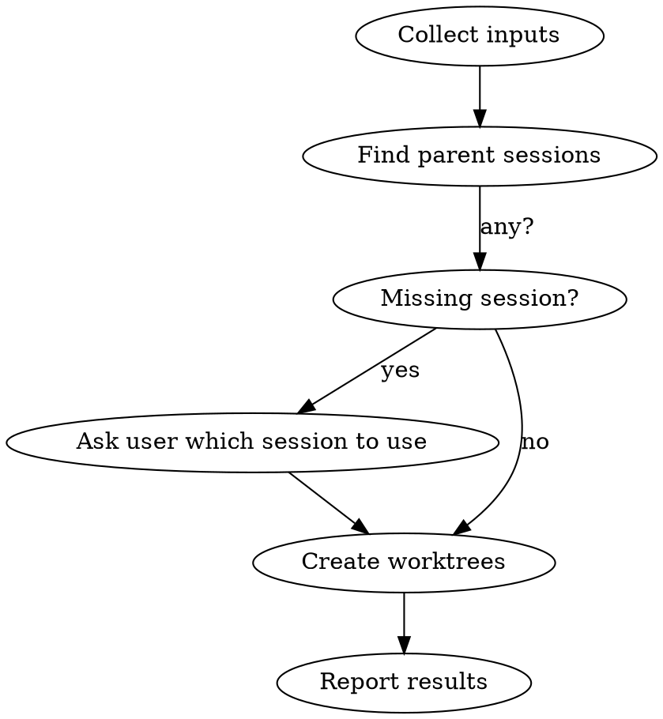

# Codeman Worktree Creator

## Overview

Create git worktrees + Codeman sessions via API. Handles multiple repos in one conversation. Base URL: `http://localhost:3001`.

## Workflow



## Step 1 — Collect Inputs

Ask the user (in one message) for everything missing:
- Which **project(s)** (repo name or path)
- **Branch name(s)** for each (e.g. `feat/my-feature`)
- **Description/notes** for each worktree — bug details, task context, etc. (pass as `notes`)
- New branch or existing? (default: new)

If user already provided these, skip asking.

## Step 2 — Find Parent Session

```bash
curl -s http://localhost:3001/api/sessions
```

Returns array of session objects. Find the best match for each project:
- Filter: `worktreeBranch` is null/absent (main sessions only, not sub-worktrees)
- Match: `workingDir` contains the project name (case-insensitive)
- Prefer: `status: idle` over `busy`; shorter `workingDir` (closer to repo root)

If multiple candidates, pick the most likely one. If none found, ask the user which session ID to use.

## Step 3 — Create Worktree

For each project × branch pair:

```bash
curl -s -X POST http://localhost:3001/api/sessions/SESSION_ID/worktree \
  -H "Content-Type: application/json" \
  -d '{"branch": "feat/my-feature", "isNew": true, "notes": "Bug: hamburger menu blocked by overlay"}'
```

**Body fields:**
| Field | Type | Required | Notes |
|-------|------|----------|-------|
| `branch` | string | yes | Full branch name e.g. `feat/my-feature` |
| `isNew` | boolean | yes | `true` = create new branch, `false` = checkout existing |
| `mode` | string | no | `claude` / `opencode` / `shell` — inherits from parent if omitted |
| `notes` | string | no | Bug description or task context (max 2000 chars) — stored on the session and sent as initial Claude prompt |

**Success response:** `{ success: true, session: {...}, worktreePath: "/path/to/worktree" }`

**Error response:** `{ success: false, error: { code, message } }`

Common errors:
- `OPERATION_FAILED` + "branch already exists" → set `isNew: false`
- `NOT_FOUND` → wrong session ID, re-fetch sessions
- `INVALID_INPUT` → branch name invalid (no spaces, valid git ref)

## Step 4 — Multiple Repos in Parallel

When creating worktrees across multiple repos, run all `curl` calls in a single Bash command with `&` and `wait`, or sequentially if you need error handling per repo.

## Step 5 — Report Results

After all calls complete, summarize:
- ✓ Created: branch name, worktree path, new session name
- ✗ Failed: error message + what to try next

---

## Merge & Close Workflow

When user wants to merge and/or close worktrees:

### Step 0 — ALWAYS clarify before acting

**Fetch all current worktrees first:**
```bash
curl -s http://localhost:3001/api/sessions | jq '[.[] | select(.worktreeBranch) | {id, name, worktreeBranch}]'
```

**If the request is ambiguous in ANY way** (vague names, multiple worktrees exist, unclear which action), show the user the list and ask explicitly:
- Which worktree(s) to act on?
- What action for each: **merge+close**, **merge only**, or **close/delete only** (destructive — no merge)?

**Never assume.** "Close the Codeman worktree" when three Codeman worktrees exist requires clarification.

### Step 1 — Safety check BEFORE any deletion

For EVERY worktree you are about to remove, check for uncommitted work:

```bash
git -C /path/to/worktree status --short
```

**If output is non-empty → STOP. Do not proceed.**

Show the user the list of changed/untracked files and ask:
- Should these be committed first?
- Or is it safe to discard them?

**NEVER use `force: true` or `git worktree remove --force` unless the user has explicitly confirmed they want to discard the uncommitted changes.** Uncommitted work is unrecoverable once the directory is deleted.

### Step 2 — Confirm the action plan

Before executing anything destructive, state clearly what you are about to do:

> "I'm about to: merge `fix/foo` into master, then delete the worktree and session. The worktree is clean. Proceeding."

Or if multiple worktrees:

> "Plan: merge+close `fix/foo`, close-only `fix/bar` (no merge). Both are clean. Proceeding."

If anything is unclear, ask — don't assume.

### Step 3 — Merge branch into parent (if merging)

Call merge on the **origin/parent** session, passing the worktree branch name:

```bash
curl -s -X POST http://localhost:3001/api/sessions/ORIGIN_SESSION_ID/worktree/merge \
  -H "Content-Type: application/json" \
  -d '{"branch": "fix/my-branch"}'
```

**Possible responses:**
- `{ success: true, output: "..." }` — merged successfully
- `{ success: false, uncommittedChanges: true, message: "..." }` — worktree has uncommitted files; commit them first then retry
- `{ success: false, error: { code: "OPERATION_FAILED", message: "Merge failed: ..." } }` — git merge error (conflicts, etc.)

If `uncommittedChanges: true` → tell the user to commit first. You can do it manually:
```bash
git -C /path/to/worktree add -A && git -C /path/to/worktree commit -m "fix: description"
```
Then retry the merge.

### Step 4 — Remove worktree and delete session

Only proceed here after the safety check (Step 1) confirmed clean or user explicitly approved discarding changes.

```bash
# Remove worktree from disk
curl -s -X DELETE http://localhost:3001/api/sessions/WORKTREE_SESSION_ID/worktree \
  -H "Content-Type: application/json" \
  -d '{"force": false}'

# Delete the Codeman session from the sidebar
curl -s -X DELETE http://localhost:3001/api/sessions/WORKTREE_SESSION_ID
```

If the session was already deleted and the worktree directory still exists, remove via git directly:
```bash
git -C /home/siggi/sources/Codeman worktree remove /path/to/worktree
# Only with --force if user explicitly approved discarding uncommitted changes
```

### Step 5 — Rebuild and deploy (if it's the Codeman repo)

```bash
npm run build && cp -r dist /home/siggi/.codeman/app/ && cp package.json /home/siggi/.codeman/app/package.json && systemctl --user restart codeman-web
```

---

## Common Mistakes

| Mistake | Fix |
|---------|-----|
| Acting on ambiguous worktree names without clarifying | Always list worktrees + confirm which ones and what action |
| Force-deleting without checking for uncommitted changes | Run `git status --short` first; stop if dirty |
| Assuming "close" means "merge then delete" | Ask: merge+close, merge only, or delete only? |
| Using a worktree session as parent | Find sessions where `worktreeBranch` is null |
| Branch name with spaces | Use hyphens/slashes only |
| `isNew: true` on existing branch | Set `isNew: false` |
| Merging when worktree has uncommitted changes | Commit in the worktree first, then merge |
| Wrong port | Codeman runs on port **3001**, not 3000 |
| Forgetting to delete the session after removing worktree | Always `DELETE /api/sessions/:id` after worktree removal |
