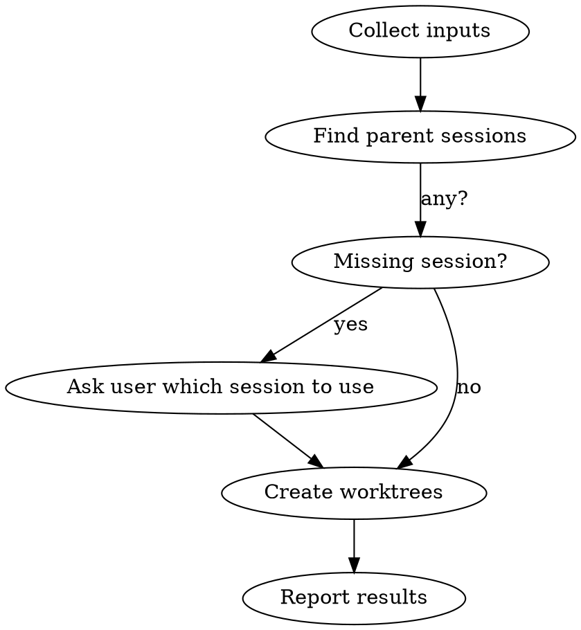

# Codeman Worktree Creator

## Overview

Create git worktrees + Codeman sessions via API. Handles multiple repos in one conversation. Base URL: `http://localhost:3001`.

## Workflow



## Step 1 — Collect Inputs

Ask the user (in one message) for everything missing:
- Which **project(s)** (repo name or path)
- **Branch name(s)** for each (e.g. `feat/my-feature`)
- **Description/notes** for each worktree — bug details, task context, etc. (pass as `notes`)
- New branch or existing? (default: new)

If user already provided these, skip asking.

## Step 2 — Find Parent Session

```bash
curl -s http://localhost:3001/api/sessions
```

Returns array of session objects. Find the best match for each project:
- Filter: `worktreeBranch` is null/absent (main sessions only, not sub-worktrees)
- Match: `workingDir` contains the project name (case-insensitive)
- Prefer: `status: idle` over `busy`; shorter `workingDir` (closer to repo root)

If multiple candidates, pick the most likely one. If none found, ask the user which session ID to use.

## Step 3 — Sync Repo to Origin Master

For each repo, before creating the worktree, ensure the local master (or main) branch is up to date with origin. Run from the repo's working directory:

```bash
git -C "<workingDir>" fetch origin
git -C "<workingDir>" merge --ff-only origin/master 2>/dev/null || \
  git -C "<workingDir>" merge --ff-only origin/main 2>/dev/null || \
  echo "SYNC_SKIPPED"
```

- `Already up to date` → fine, continue
- Fast-forward succeeds → continue
- `SYNC_SKIPPED` (no origin/master or origin/main) → skip silently, continue
- `fatal: Not possible to fast-forward` → **stop and report:** "Local master has commits not in origin — manual rebase required before creating this worktree."

Do not create the worktree if fast-forward fails. This ensures the new branch always starts from the latest upstream commit.

## Step 4 — Create Worktree

For each project × branch pair:

```bash
curl -s -X POST http://localhost:3001/api/sessions/SESSION_ID/worktree \
  -H "Content-Type: application/json" \
  -d '{"branch": "feat/my-feature", "isNew": true, "notes": "Bug: hamburger menu blocked by overlay", "autoStart": true}'
```

**Body fields:**
| Field | Type | Required | Notes |
|-------|------|----------|-------|
| `branch` | string | yes | Full branch name e.g. `feat/my-feature` |
| `isNew` | boolean | yes | `true` = create new branch, `false` = checkout existing |
| `mode` | string | no | `claude` / `opencode` / `shell` — inherits from parent if omitted |
| `notes` | string | no | Bug description or task context (max 2000 chars) — stored on the session and sent as initial Claude prompt |
| `autoStart` | boolean | no | `true` = immediately spawn Claude process after creation (default: omitted/false) |

**Success response:** `{ success: true, session: {...}, worktreePath: "/path/to/worktree" }`

**Error response:** `{ success: false, error: { code, message } }`

Common errors:
- `OPERATION_FAILED` + "branch already exists" → set `isNew: false`
- `NOT_FOUND` → wrong session ID, re-fetch sessions
- `INVALID_INPUT` → branch name invalid (no spaces, valid git ref)

## Step 5 — Multiple Repos in Parallel

When creating worktrees across multiple repos, run all sync + curl operations sequentially per repo (sync must complete before the worktree is created for that repo).

## Step 6 — Report Results

After all calls complete, summarize:
- ✓ Created: branch name, worktree path, new session name
- ✗ Failed: error message + what to try next

To merge or close worktrees, use the **codeman-merge-worktree** skill.

---

## Common Mistakes

| Mistake | Fix |
|---------|-----|
| Using a worktree session as parent | Find sessions where `worktreeBranch` is null |
| Branch name with spaces | Use hyphens/slashes only |
| `isNew: true` on existing branch | Set `isNew: false` |
| Wrong port | Codeman runs on port **3001**, not 3000 |
| Skipping the sync step | Always sync before creating — branching from stale master means missing upstream commits |
| Creating worktree when fast-forward fails | Stop and tell the user — do not force-create on a diverged master |
