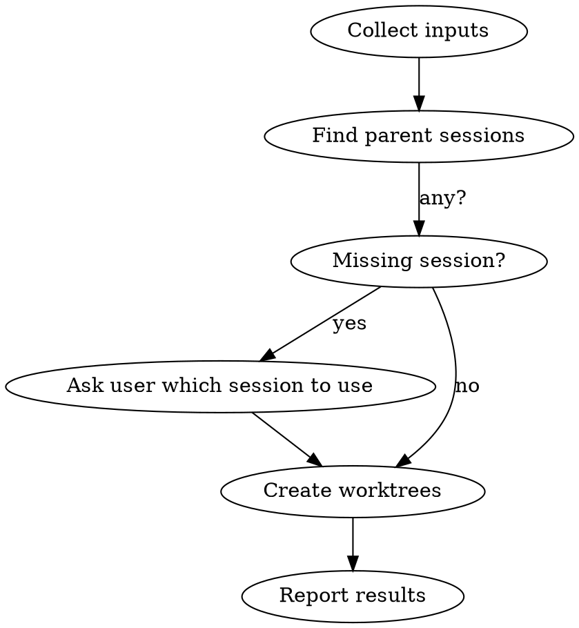

# Codeman Worktree Creator

## Overview

Create git worktrees + Codeman sessions via API. Handles multiple repos in one conversation. Base URL: `http://localhost:3001`.

## Workflow


```dot
digraph flow {
  "Collect inputs" -> "Find parent sessions";
  "Find parent sessions" -> "Missing session?" [label="any?"];
  "Missing session?" -> "Ask user which session to use" [label="yes"];
  "Missing session?" -> "Create worktrees" [label="no"];
  "Ask user which session to use" -> "Create worktrees";
  "Create worktrees" -> "Report results";
}
```

## Step 1 — Collect Inputs

Ask the user (in one message) for everything missing:
- Which **project(s)** (repo name or path)
- **Branch name(s)** for each (e.g. `feat/my-feature`)
- **Task description** for each worktree — bug details, feature spec, task context
- New branch or existing? (default: new)

If user already provided these, skip asking.

## Step 2 — Find Parent Session

```bash
curl -s http://localhost:3001/api/sessions
```

Returns array of session objects. Find the best match for each project:
- Filter: `worktreeBranch` is null/absent (main sessions only, not sub-worktrees)
- Match: `workingDir` contains the project name (case-insensitive)
- Prefer: `status: idle` over `busy`; shorter `workingDir` (closer to repo root)

If multiple candidates, pick the most likely one. If none found, ask the user which session ID to use.

## Step 3 — Sync Repo to Origin Master

For each repo, before creating the worktree, ensure the local master (or main) branch is up to date with origin. Run from the repo's working directory:

```bash
git -C "<workingDir>" fetch origin
git -C "<workingDir>" merge --ff-only origin/master 2>/dev/null || \
  git -C "<workingDir>" merge --ff-only origin/main 2>/dev/null || \
  echo "SYNC_SKIPPED"
```

- `Already up to date` → fine, continue
- Fast-forward succeeds → continue
- `SYNC_SKIPPED` (no origin/master or origin/main) → skip silently, continue
- `fatal: Not possible to fast-forward` → **stop and report:** "Local master has commits not in origin — manual rebase required before creating this worktree."

Do not create the worktree if fast-forward fails. This ensures the new branch always starts from the latest upstream commit.

## Step 4 — Create Worktree

Pass `taskMd` and `claudeMd` inline so the server writes them atomically before returning. This eliminates the race condition where Claude starts before TASK.md exists.

For each project × branch pair:

```bash
curl -s -X POST http://localhost:3001/api/sessions/SESSION_ID/worktree \
  -H "Content-Type: application/json" \
  -d '{
    "branch": "feat/my-feature",
    "isNew": true,
    "mode": "claude",
    "notes": "Read TASK.md in this directory, then invoke the codeman-task-runner skill.",
    "autoStart": false,
    "taskMd": "<TASK.md content as JSON string — see Step 4a>",
    "claudeMd": "<CLAUDE.md content as JSON string — see Step 4b>"
  }'
```

**Always send `"mode": "claude"` explicitly.** If omitted, the worktree inherits the parent session's mode — and parent sessions are frequently in `shell` mode, which silently produces a shell worktree with no Claude running. Only override to `opencode`/`shell` if the user explicitly asks for it.

**Body fields:**
| Field | Type | Required | Notes |
|-------|------|----------|-------|
| `branch` | string | yes | Full branch name e.g. `feat/my-feature` |
| `isNew` | boolean | yes | `true` = create new branch, `false` = checkout existing |
| `mode` | string | **yes (set `claude`)** | `claude` / `opencode` / `shell`. **Inherits from parent if omitted — and the parent is often `shell`, giving a session with no Claude. Always pass `"claude"`** unless the user asks otherwise. |
| `notes` | string | no | Short trigger sentence — stored on session, sent as initial prompt |
| `autoStart` | boolean | no | **Always `false`** — use `/interactive` after creation to avoid race conditions |
| `taskMd` | string | no | Full TASK.md content — server writes this atomically before returning |
| `claudeMd` | string | no | Full CLAUDE.md content — server writes this atomically before returning |

**Do NOT write TASK.md or CLAUDE.md separately** — always use the `taskMd`/`claudeMd` fields so files exist before Claude starts.

**Success response:** `{ success: true, session: {...}, worktreePath: "/path/to/worktree" }`

**Error response:** `{ success: false, error: { code, message } }`

Common errors:
- `OPERATION_FAILED` + "branch already exists" → set `isNew: false`
- `NOT_FOUND` → wrong session ID, re-fetch sessions
- `INVALID_INPUT` → branch name invalid (no spaces, valid git ref)

### Step 4a — TASK.md content

Build the TASK.md from the user's task description. JSON-escape newlines as `\n`:

```markdown
# Task

type: <bug|feature>
status: analysis
title: <title from user>
description: <full description from user>
affected_area: unknown
fix_cycles: 0
test_fix_cycles: 0

## Reproduction
<!-- filled by analysis phase -->

## Root Cause / Spec
<!-- filled by analysis phase -->

## Fix / Implementation Notes
<!-- filled by fix phase -->

## Review History
<!-- appended by each review — never overwrite -->

## Test Gap Analysis
<!-- filled by test gap analysis -->

## QA Results
<!-- filled by QA phase -->

## Decisions & Context
<!-- append-only log of key decisions -->
```

If the project has its own TASK.md template (e.g. in `.skills/`), use that instead.

### Step 4b — CLAUDE.md content

Use a generic worktree CLAUDE.md. If the project has its own worktree CLAUDE.md convention (e.g. referencing project-specific skills like `.skills/fix-workflow.md`), use that instead.

Generic default:
```markdown
You are working autonomously in a Codeman worktree.
Before doing ANYTHING else, re-read `TASK.md` in this directory
and resume from the phase in `status`.
Do not rely on conversation history.
Then invoke the codeman-task-runner skill.
```

## Step 4c — Isolate Artifacts (copy node_modules & env — never symlink)

Codeman's worktree creation **symlinks** gitignored artifacts from the git root into the new
worktree (`node_modules`, `dist`, `src/web/public/vendor`, `.mcp.json` — see
`setupWorktreeArtifacts` in Codeman's `git-utils.ts`). **A symlinked `node_modules` is dangerous:**
a `pnpm add/remove`, `npm install`, or `pnpm install` run inside the worktree mutates the **parent
repo's** `node_modules`, silently breaking every other worktree and the main checkout.

After creating each worktree, isolate it so it never shares mutable state with the parent:

```bash
SRC="<parent repo root>"          # e.g. /home/siggi/sources/keepscms/keeps
WT="<worktreePath from Step 4>"

# 1. Remove the symlinked node_modules (root and any nested) so it isn't shared.
find "$WT" -maxdepth 3 -name node_modules -type l -delete

# 2. Copy env files (small, gitignored, must be real copies for isolation — e.g. point one
#    worktree at sandbox without affecting others). Copy whatever the project uses; for keeps:
for f in apps/app/.env.local apps/app/.env.prod apps/admin/.env.local \
         apps/admin/.env.vercel.prod apps/webhooks/.env.local packages/e2e/.env.test; do
  [ -f "$SRC/$f" ] && mkdir -p "$WT/$(dirname "$f")" && cp "$SRC/$f" "$WT/$f"
done

# 3. Materialize an isolated node_modules. For pnpm/npm/yarn this is the correct "copy" — the
#    package manager builds an isolated tree from its global content-addressable store (fast,
#    disk-efficient, root + per-app), and a later install/add never touches the parent.
( cd "$WT" && CI=1 NODE_ENV=development pnpm install --prod=false )   # use the project's package manager
```

**Gotcha:** the Bash tool's environment may have `NODE_ENV=production` set, which makes `pnpm install`
silently skip devDependencies (no `vitest`/`tsc` → the worktree can't test or typecheck). Always pass
`CI=1 NODE_ENV=development pnpm install --prod=false`: `CI=1` makes the reinstall non-interactive (no
"remove modules?" prompt that hangs a background shell), and `--prod=false`/`NODE_ENV=development`
force devDependencies. Verify afterward that `apps/<app>/node_modules/.bin/vitest` exists.

**Why install instead of `cp -r node_modules`?** For a pnpm monorepo a literal copy only covers the
root `node_modules` (per-app `node_modules` are separate) and explodes the internal symlink farm.
`pnpm install` produces a complete, isolated, parent-independent tree — that *is* the copy you want.
If `pnpm` isn't on PATH in the Bash tool, use its absolute path (e.g. `/home/siggi/.local/share/pnpm/pnpm`).

The `.mcp.json` symlink can stay (read-only config). Only `node_modules` and env files must be real
copies.

## Step 5 — Start Sessions

After each worktree is created, start Claude:

```bash
curl -s -X POST http://localhost:3001/api/sessions/NEW_SESSION_ID/interactive
```

Use the session ID from the Step 4 response (`session.id`). **Never use `autoStart: true`** — it races against file writes.

**Verify the mode after creation.** Check `session.mode` in the Step 4 response is `claude` before starting. If it came back `shell` (mode was omitted or inherited), delete the session (`DELETE /api/sessions/:id?killMux=true`), remove the leftover git worktree + branch (`git worktree remove --force <path> && git branch -D <branch> && git worktree prune`), then recreate with `"mode": "claude"`.

## Step 6 — Multiple Repos in Parallel

When creating worktrees across multiple repos, run all sync + curl operations sequentially per repo (sync must complete before the worktree is created for that repo).

## Step 7 — Report Results

After all calls complete, summarize:
- ✓ Created: branch name, worktree path, new session name, session started
- ✗ Failed: error message + what to try next

To merge or close worktrees, use the **codeman-merge-worktree** skill.

---

## Common Mistakes

| Mistake | Fix |
|---------|-----|
| Omitting `mode` → session starts in `shell` with no Claude | **Always pass `"mode": "claude"`** in the create body. Omitting it inherits the parent's mode, which is usually `shell`. Verify `session.mode === "claude"` in the response. |
| Leaving `node_modules` symlinked to the parent | **Do Step 4c.** A symlinked `node_modules` means a worktree install mutates the parent repo. Remove the symlink, copy env files, and run an isolated `pnpm install`. |
| `pnpm install` skips devDependencies | The shell may have `NODE_ENV=production`. Use `CI=1 NODE_ENV=development pnpm install --prod=false` and confirm `vitest` is present. |
| Writing TASK.md/CLAUDE.md separately with Write tool | **Always use `taskMd`/`claudeMd` fields** in the worktree creation request — the server writes them atomically before returning, eliminating race conditions |
| Using `autoStart: true` | **Always use `autoStart: false`**, then call `/interactive` after creation returns — `autoStart` races against file writes |
| Sending input without `\r` | When using `/api/sessions/:id/input`, always append `\r` and include `"useMux": true"` — without `\r` text is typed but never submitted |
| Using a worktree session as parent | Find sessions where `worktreeBranch` is null |
| Branch name with spaces | Use hyphens/slashes only |
| `isNew: true` on existing branch | Set `isNew: false` |
| Wrong port | Codeman runs on port **3001**, not 3000 |
| Skipping the sync step | Always sync before creating — branching from stale master means missing upstream commits |
| Creating worktree when fast-forward fails | Stop and tell the user — do not force-create on a diverged master |
